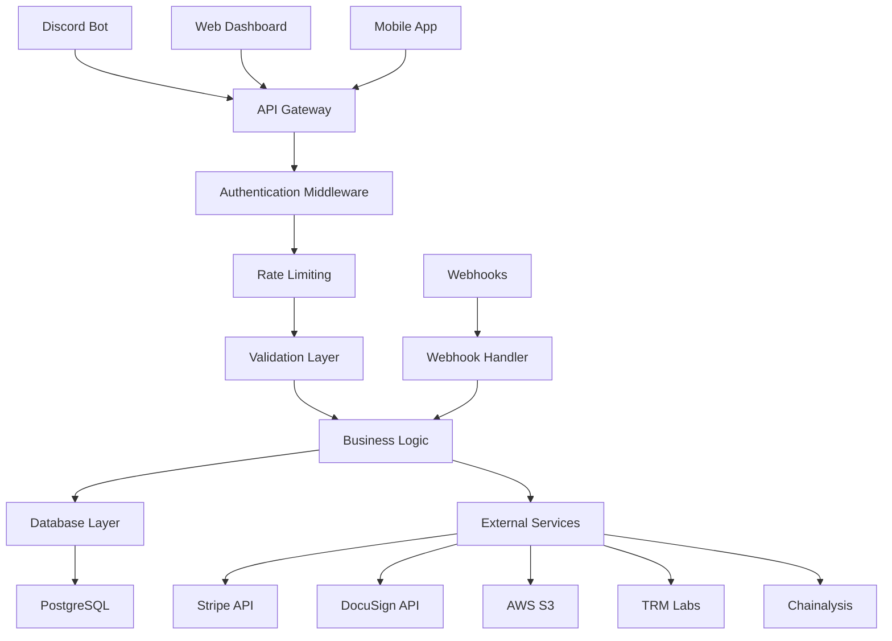

# API Architecture

## Overview

The Bloxtr8 API is a RESTful Express.js server that handles all business logic, webhooks, and external integrations for the escrow platform.

## Architecture Diagram



## API Endpoints

### Authentication

```typescript
POST /auth/discord
POST /auth/refresh
POST /auth/logout
GET  /auth/me
```

### Users

```typescript
GET    /api/users/:id
PUT    /api/users/:id
POST   /api/users
GET    /api/users/:id/listings
GET    /api/users/:id/offers
```

### Listings

```typescript
GET    /api/listings
POST   /api/listings
GET    /api/listings/:id
PUT    /api/listings/:id
DELETE /api/listings/:id
GET    /api/listings/:id/offers
```

### Offers

```typescript
GET    /api/offers
POST   /api/offers
GET    /api/offers/:id
PUT    /api/offers/:id
POST   /api/offers/:id/accept
POST   /api/offers/:id/decline
POST   /api/offers/:id/counter
```

### Contracts

```typescript
POST   /api/contracts
GET    /api/contracts/:id
POST   /api/contracts/:id/sign
GET    /api/contracts/:id/pdf
```

### Escrow

```typescript
POST   /api/escrow
GET    /api/escrow/:id
POST   /api/escrow/:id/fund
POST   /api/escrow/:id/deliver
POST   /api/escrow/:id/release
POST   /api/escrow/:id/refund
```

### Disputes

```typescript
POST   /api/disputes
GET    /api/disputes
GET    /api/disputes/:id
PUT    /api/disputes/:id
POST   /api/disputes/:id/resolve
```

## Request/Response Patterns

### Standard Response Format

```typescript
interface ApiResponse<T> {
  success: boolean;
  data?: T;
  error?: string;
  message?: string;
  timestamp: string;
}

// Success Response
{
  "success": true,
  "data": {
    "id": "user-123",
    "username": "example_user",
    "kycVerified": true
  },
  "message": "User retrieved successfully",
  "timestamp": "2024-01-15T10:30:00Z"
}

// Error Response
{
  "success": false,
  "error": "VALIDATION_ERROR",
  "message": "Invalid email format",
  "timestamp": "2024-01-15T10:30:00Z"
}
```

### Pagination

```typescript
interface PaginatedResponse<T> {
  data: T[];
  pagination: {
    page: number;
    limit: number;
    total: number;
    totalPages: number;
    hasNext: boolean;
    hasPrev: boolean;
  };
}

// Example
{
  "data": [...],
  "pagination": {
    "page": 1,
    "limit": 20,
    "total": 150,
    "totalPages": 8,
    "hasNext": true,
    "hasPrev": false
  }
}
```

## Authentication & Authorization

### JWT Token Structure

```typescript
interface JWTPayload {
  userId: string;
  discordId: string;
  username: string;
  kycTier: KycTier;
  kycVerified: boolean;
  iat: number;
  exp: number;
}
```

### Middleware Stack

```typescript
// Authentication middleware
app.use('/api', authenticateToken);

// Rate limiting
app.use('/api', rateLimit({
  windowMs: 15 * 60 * 1000, // 15 minutes
  max: 100 // limit each IP to 100 requests per windowMs
}));

// CORS
app.use(cors({
  origin: process.env.ALLOWED_ORIGINS?.split(','),
  credentials: true
}));

// Security headers
app.use(helmet());
```

## Error Handling

### Error Types

```typescript
enum ErrorType {
  VALIDATION_ERROR = 'VALIDATION_ERROR',
  AUTHENTICATION_ERROR = 'AUTHENTICATION_ERROR',
  AUTHORIZATION_ERROR = 'AUTHORIZATION_ERROR',
  NOT_FOUND = 'NOT_FOUND',
  CONFLICT = 'CONFLICT',
  RATE_LIMITED = 'RATE_LIMITED',
  EXTERNAL_SERVICE_ERROR = 'EXTERNAL_SERVICE_ERROR',
  INTERNAL_ERROR = 'INTERNAL_ERROR'
}
```

### Error Handler Middleware

```typescript
export function errorHandler(
  error: Error,
  req: Request,
  res: Response,
  next: NextFunction
) {
  const statusCode = getStatusCode(error);
  const errorType = getErrorType(error);
  
  res.status(statusCode).json({
    success: false,
    error: errorType,
    message: error.message,
    timestamp: new Date().toISOString(),
    ...(process.env.NODE_ENV === 'development' && { stack: error.stack })
  });
}
```

## Webhook Integration

### Stripe Webhooks

```typescript
app.post('/webhooks/stripe', express.raw({type: 'application/json'}), (req, res) => {
  const sig = req.headers['stripe-signature'];
  const event = stripe.webhooks.constructEvent(req.body, sig, process.env.STRIPE_WEBHOOK_SECRET);
  
  switch (event.type) {
    case 'payment_intent.succeeded':
      handlePaymentSuccess(event.data.object);
      break;
    case 'payment_intent.payment_failed':
      handlePaymentFailure(event.data.object);
      break;
    case 'charge.dispute.created':
      handleDisputeCreated(event.data.object);
      break;
  }
  
  res.json({received: true});
});
```

### Custodian Webhooks

```typescript
app.post('/webhooks/custodian', (req, res) => {
  const { eventId, type, data } = req.body;
  
  // Verify webhook signature
  if (!verifyCustodianSignature(req)) {
    return res.status(401).json({ error: 'Invalid signature' });
  }
  
  switch (type) {
    case 'deposit.confirmed':
      handleDepositConfirmed(data);
      break;
    case 'transfer.completed':
      handleTransferCompleted(data);
      break;
  }
  
  res.json({ received: true });
});
```

## Testing Strategy

### Unit Tests

```typescript
describe('User Controller', () => {
  it('should create a new user', async () => {
    const userData = {
      discordId: '123456789',
      username: 'test_user',
      email: 'test@example.com'
    };
    
    const response = await request(app)
      .post('/api/users')
      .send(userData)
      .expect(201);
    
    expect(response.body.success).toBe(true);
    expect(response.body.data.username).toBe(userData.username);
  });
});
```

### Integration Tests

```typescript
describe('Escrow Flow', () => {
  it('should complete full escrow transaction', async () => {
    // 1. Create listing
    const listing = await createTestListing();
    
    // 2. Create offer
    const offer = await createTestOffer(listing.id);
    
    // 3. Accept offer
    await acceptOffer(offer.id);
    
    // 4. Create contract
    const contract = await createContract(offer.id);
    
    // 5. Create escrow
    const escrow = await createEscrow(offer.id, contract.id);
    
    // 6. Fund escrow
    await fundEscrow(escrow.id);
    
    // 7. Deliver item
    await deliverItem(escrow.id);
    
    // 8. Release funds
    await releaseFunds(escrow.id);
    
    // Verify final state
    const finalEscrow = await getEscrow(escrow.id);
    expect(finalEscrow.status).toBe('RELEASED');
  });
});
```

## Performance & Monitoring

### Health Checks

```typescript
app.get('/health', async (req, res) => {
  const checks = {
    database: await checkDatabase(),
    redis: await checkRedis(),
    external_apis: await checkExternalAPIs()
  };
  
  const isHealthy = Object.values(checks).every(check => check.status === 'healthy');
  
  res.status(isHealthy ? 200 : 503).json({
    status: isHealthy ? 'healthy' : 'unhealthy',
    checks,
    timestamp: new Date().toISOString()
  });
});
```

### Metrics Collection

```typescript
// Request metrics
app.use((req, res, next) => {
  const start = Date.now();
  
  res.on('finish', () => {
    const duration = Date.now() - start;
    metrics.recordRequest({
      method: req.method,
      path: req.path,
      statusCode: res.statusCode,
      duration
    });
  });
  
  next();
});
```
