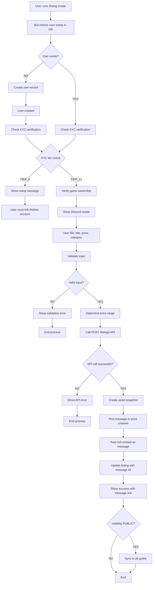
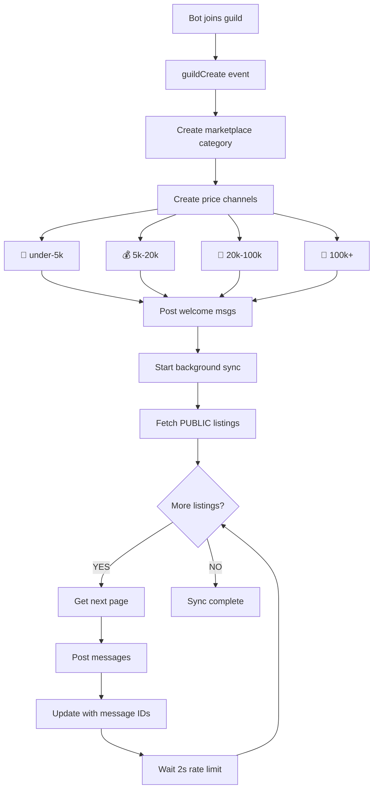
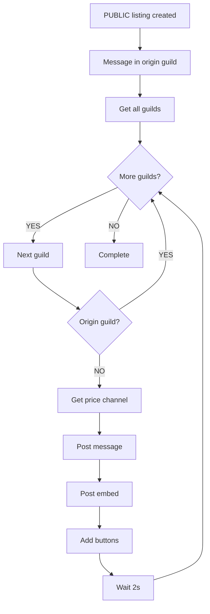
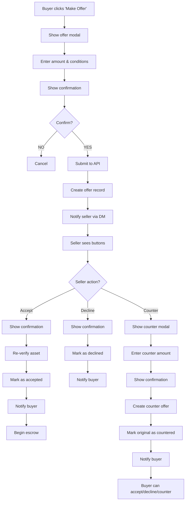
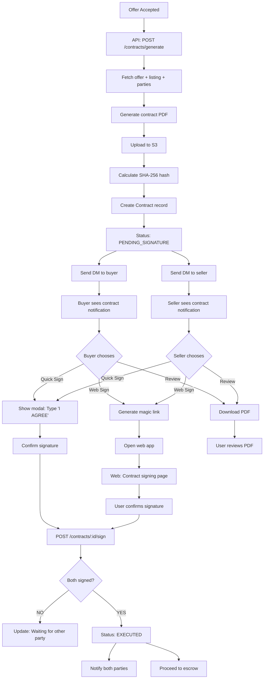
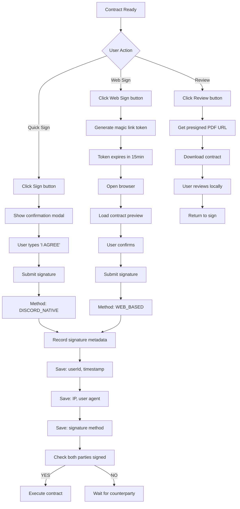
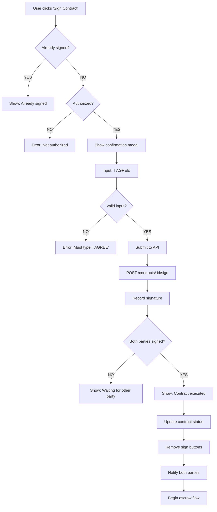

# Discord Bot Flow Diagrams

## 🎮 Message-Based Marketplace Architecture

### Listing Creation Flow



### Guild Join Flow



### Cross-Guild Sync Flow



## Key Features

### Price-Range Channels

The bot automatically creates 4 channels based on listing price:

- **💚 bloxtr8-under-5k**: Under $5,000 deals
- **💰 bloxtr8-5k-20k**: $5,000 - $20,000 deals
- **💎 bloxtr8-20k-100k**: $20,000 - $100,000 deals
- **👑 bloxtr8-100k+**: $100,000+ premium deals

### Message Structure

Each listing is displayed as a rich embedded message with:

```
🟢 New Global Listing
├── Rich Embed
│   ├── 🎮 Game Name - Game thumbnail
│   ├── 💰 Price: $15,000
│   ├── ✅ Verified Seller (KYC Badge)
│   ├── 🌍 PUBLIC Listing
│   └── 📊 Game stats (players, visits)
│
└── Action Buttons
    ├── 💸 Make Offer
    ├── 📋 View Offers
    ├── 🌐 View on Web
    └── 👁️ Watch Listing
```

### Visibility System

**PUBLIC Listings:**

- Posted as messages in ALL guilds bot is in
- Synced automatically on guild join
- Cross-server marketplace experience

**PRIVATE Listings:**

- Only visible in origin guild
- Perfect for guild-exclusive deals
- Full marketplace features

## Components

### 1. User Verification

- Ensures user exists in database
- Checks KYC tier (must be TIER_1+)
- Verifies Roblox account linked

### 2. Game Ownership Verification

- Validates user owns/admin of game
- Creates verification record
- Stores game metadata

### 3. Message Creation

- Determines price range from listing price
- Posts message in appropriate channel
- Posts rich embed with all details
- Adds interactive buttons

### 4. Cross-Guild Sync

- Background process for PUBLIC listings
- Rate-limited (2s between messages)
- Updates database with message IDs
- Handles errors gracefully

### 5. Guild Setup

- Auto-creates marketplace category
- Creates 4 price-range channels
- Sets proper permissions
- Posts welcome messages
- Syncs existing PUBLIC listings

### 6. Offer Negotiation

- Button-based offer system in DMs
- Accept/Decline/Counter offer flow
- Private negotiations with sellers
- Real-time notifications

## Error Handling

- **User not found** → Create user record
- **Not TIER_1+** → Show setup message
- **Invalid input** → Validation error
- **API failure** → Error message with retry
- **Message creation fails** → Listing still created
- **Rate limit hit** → Automatic backoff

## Rate Limiting

To respect Discord API limits:

- **2 seconds** between message posts
- **1 second** between pagination pages
- **5 seconds** between guild syncs
- **Max 50 messages** per 10 minutes (Discord limit)

## Database Updates

### Listing Model

```prisma
model Listing {
  // ... existing fields
  messageId   String?   @unique
  channelId   String?
  priceRange  String?
  visibility  ListingVisibility @default(PUBLIC)
}
```

### New Models

```prisma
model MarketplaceChannel {
  id             String
  guildId        String
  channelId      String
  priceRange     String
  activeListings Int
}
```

## API Endpoints

### Enhanced Endpoints

- `POST /api/listings` - Now accepts `visibility`, `messageId`, `priceRange`
- `GET /api/listings` - Filters by visibility and cross-guild
- `PATCH /api/listings/:id/message` - Updates message information
- `POST /api/offers` - Create offer on a listing
- `PATCH /api/offers/:id/accept` - Accept an offer
- `PATCH /api/offers/:id/decline` - Decline an offer
- `PATCH /api/offers/:id/counter` - Counter an offer
- `GET /api/offers/listing/:id` - Get all offers for a listing

## Offer Negotiation Flow



## Contract Generation & Signing Flow



### Contract Signing Methods



### Signature Confirmation Flow



## Future Enhancements

- [ ] `/listing view` command with message links
- [ ] `/contract list` command full implementation
- [ ] Message activity scoring
- [ ] Rich media from Roblox API
- [x] Offer management via buttons
- [x] Contract generation and signing
- [ ] Analytics dashboard
- [ ] Automated message cleanup
- [ ] Trending listings
