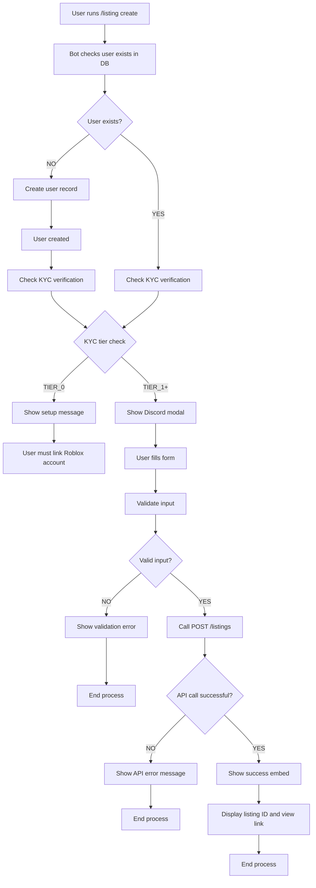

# Listing Creation Flow Diagram

## Key Components

1. **User Verification**: Ensures user exists and is TIER_1+ (can create listings)
2. **Modal Form**: Discord modal for collecting listing details
3. **Input Validation**: Client-side and server-side validation
4. **API Integration**: Calls existing POST /listings endpoint
5. **Success Response**: Rich embed with listing details and link

## Error Handling Points

- User not found → Create user record
- User not TIER_1+ → Show account setup message
- Invalid form input → Show validation error
- API failure → Show API error message
- Network error → Show generic error message
