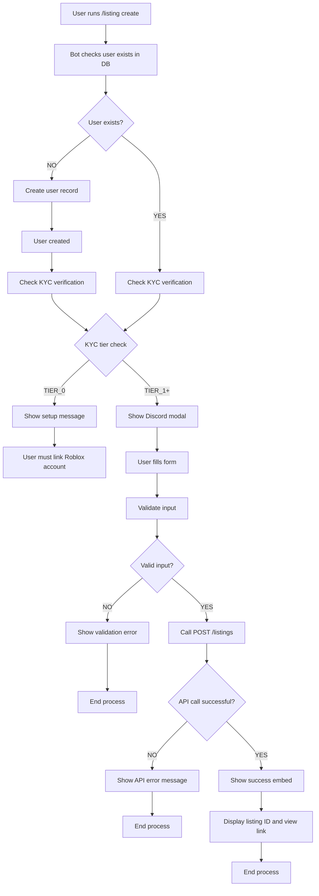
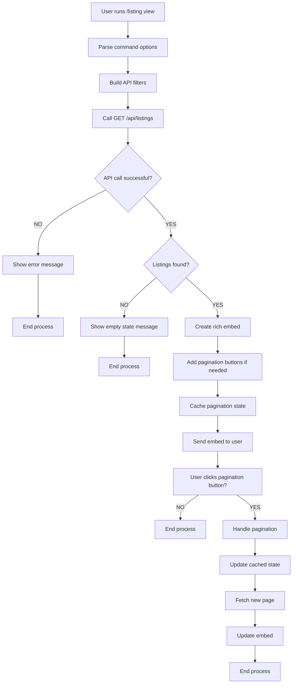

# Discord Bot Listing Commands Flow Diagram

## Listing Creation Flow

## Listing View Flow

## Key Components

### Listing Creation
1. **User Verification**: Ensures user exists and is TIER_1+ (can create listings)
2. **Modal Form**: Discord modal for collecting listing details
3. **Input Validation**: Client-side and server-side validation
4. **API Integration**: Calls existing POST /listings endpoint
5. **Success Response**: Rich embed with listing details and link

### Listing View
1. **Filtering**: Support for category and status filters
2. **Pagination**: Button-based navigation with cached state
3. **Rich Embeds**: Formatted display with price, seller, and date info
4. **API Integration**: Calls GET /api/listings with pagination
5. **State Management**: In-memory cache for pagination state (5min TTL)

## Error Handling Points

### Listing Creation
- User not found → Create user record
- User not TIER_1+ → Show account setup message
- Invalid form input → Show validation error
- API failure → Show API error message
- Network error → Show generic error message

### Listing View
- API failure → Show error message with retry suggestion
- Empty results → Show appropriate empty state message
- Pagination timeout → Prompt user to restart command
- Invalid filters → Use default filters and continue
