# Discord Bot Flow Diagrams

## 🎮 Thread-Based Marketplace Architecture

### Listing Creation Flow


### Guild Join Flow

```mermaid
flowchart TD
    A[Bot joins guild] --> B[guildCreate event]
    B --> C[Create marketplace category]
    C --> D[Create price channels]
    D --> E[📈 1k-5k]
    D --> F[💰 5k-25k]
    D --> G[💎 25k-100k]
    D --> H[👑 100k+]

    E --> I[Post welcome msgs]
    F --> I
    G --> I
    H --> I

    I --> J[Start background sync]
    J --> K[Fetch PUBLIC listings]
    K --> L{More listings?}

    L -->|YES| M[Get next page]
    M --> N[Create threads]
    N --> O[Update with thread IDs]
    O --> P[Wait 2s rate limit]
    P --> L

    L -->|NO| Q[Sync complete]
```



### Cross-Guild Sync Flow


## Key Features

### Price-Range Channels

The bot automatically creates 4 channels based on listing price:

- **📈 marketplace-1k-5k**: $1,000 - $5,000 deals
- **💰 marketplace-5k-25k**: $5,000 - $25,000 deals
- **💎 marketplace-25k-100k**: $25,000 - $100,000 deals
- **👑 marketplace-100k+**: $100,000+ premium deals

### Thread Structure

Each listing gets a dedicated thread with:

```
🟢 Game Name - $15k | ✅
├── Rich Embed
│   ├── 🎮 Game thumbnail
│   ├── 💰 Price: $15,000
│   ├── ✅ Verified Seller (KYC Badge)
│   ├── 🌍 PUBLIC Listing
│   └── 📊 Game stats (players, visits)
│
└── Action Buttons
    ├── 💸 Make Offer
    ├── 🔍 View Details
    ├── 🌐 View on Web
    └── 👁️ Watch Listing
```

### Visibility System

**PUBLIC Listings:**

- Created as threads in ALL guilds bot is in
- Synced automatically on guild join
- Cross-server marketplace experience

**PRIVATE Listings:**

- Only visible in origin guild
- Perfect for guild-exclusive deals
- Full marketplace features

## Components

### 1. User Verification

- Ensures user exists in database
- Checks KYC tier (must be TIER_1+)
- Verifies Roblox account linked

### 2. Game Ownership Verification

- Validates user owns/admin of game
- Creates verification record
- Stores game metadata

### 3. Thread Creation

- Determines price range from listing price
- Creates thread in appropriate channel
- Posts rich embed with all details
- Adds interactive buttons

### 4. Cross-Guild Sync

- Background process for PUBLIC listings
- Rate-limited (2s between threads)
- Updates database with thread IDs
- Handles errors gracefully

### 5. Guild Setup

- Auto-creates marketplace category
- Creates 4 price-range channels
- Sets proper permissions
- Posts welcome messages
- Syncs existing PUBLIC listings

## Error Handling

- **User not found** → Create user record
- **Not TIER_1+** → Show setup message
- **Invalid input** → Validation error
- **API failure** → Error message with retry
- **Thread creation fails** → Listing still created
- **Rate limit hit** → Automatic backoff

## Rate Limiting

To respect Discord API limits:

- **2 seconds** between thread creations
- **1 second** between pagination pages
- **5 seconds** between guild syncs
- **Max 50 threads** per 10 minutes (Discord limit)

## Database Updates

### Listing Model

```prisma
model Listing {
  // ... existing fields
  threadId    String?   @unique
  channelId   String?
  priceRange  String?
  visibility  ListingVisibility @default(PUBLIC)
}
```

### New Models

```prisma
model MarketplaceChannel {
  id             String
  guildId        String
  channelId      String
  priceRange     String
  activeListings Int
}
```

## API Endpoints

### Enhanced Endpoints

- `POST /api/listings` - Now accepts `visibility`, `threadId`, `priceRange`
- `GET /api/listings` - Filters by visibility and cross-guild
- `PATCH /api/listings/:id/thread` - Updates thread information

## Future Enhancements

- [ ] `/listing view` command with thread links
- [ ] Thread activity scoring
- [ ] Rich media from Roblox API
- [ ] Offer management in threads
- [ ] Analytics dashboard
- [ ] Automated thread archiving
- [ ] Trending listings
