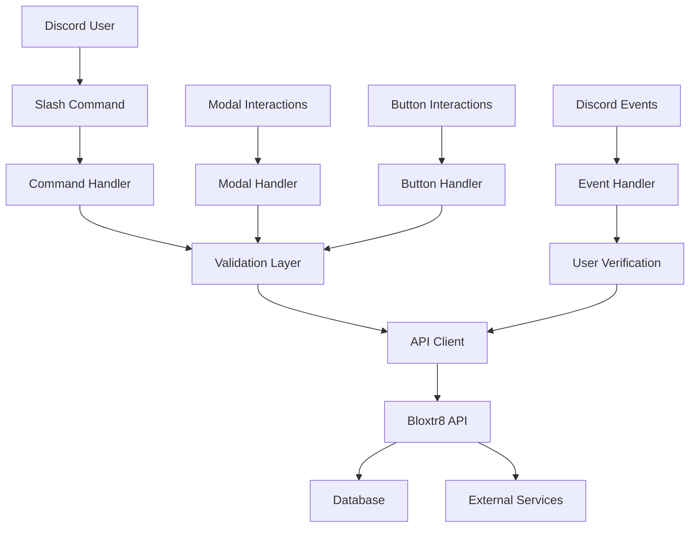

# Discord Bot Architecture

## Overview

The Bloxtr8 Discord bot provides a seamless Discord-native interface for the escrow platform, handling slash commands, interactions, and user management.

## Bot Architecture



## Command Structure

### Slash Commands

```typescript
// Command registration
const commands = [
  {
    name: 'listing',
    description: 'Manage Roblox asset listings',
    options: [
      {
        type: ApplicationCommandOptionType.Subcommand,
        name: 'create',
        description: 'Create a new listing',
      },
      {
        type: ApplicationCommandOptionType.Subcommand,
        name: 'view',
        description: 'View your listings',
        options: [
          {
            type: ApplicationCommandOptionType.String,
            name: 'id',
            description: 'Listing ID to view',
            required: false,
          },
        ],
      },
    ],
  },
  {
    name: 'offer',
    description: 'Manage offers for listings',
    options: [
      {
        type: ApplicationCommandOptionType.Subcommand,
        name: 'make',
        description: 'Make an offer on a listing',
        options: [
          {
            type: ApplicationCommandOptionType.String,
            name: 'listing_id',
            description: 'ID of the listing to offer on',
            required: true,
          },
        ],
      },
    ],
  },
];
```

### Command Handlers

```typescript
// Listing command handler
export async function handleListingCommand(interaction: CommandInteraction) {
  const subcommand = interaction.options.getSubcommand();

  switch (subcommand) {
    case 'create':
      return handleCreateListing(interaction);
    case 'view':
      return handleViewListings(interaction);
    default:
      return interaction.reply({
        content: 'Unknown subcommand',
        ephemeral: true,
      });
  }
}

// Create listing handler
async function handleCreateListing(interaction: CommandInteraction) {
  // Check user verification
  const user = await verifyUser(interaction.user.id);
  if (!user.kycVerified) {
    return interaction.reply({
      content: 'You must complete KYC verification before creating listings.',
      ephemeral: true,
    });
  }

  // Show modal for listing details
  const modal = new ModalBuilder()
    .setCustomId('create_listing_modal')
    .setTitle('Create New Listing');

  const titleInput = new TextInputBuilder()
    .setCustomId('title')
    .setLabel('Listing Title')
    .setStyle(TextInputStyle.Short)
    .setMaxLength(200)
    .setRequired(true);

  const summaryInput = new TextInputBuilder()
    .setCustomId('summary')
    .setLabel('Description')
    .setStyle(TextInputStyle.Paragraph)
    .setMaxLength(1000)
    .setRequired(true);

  const priceInput = new TextInputBuilder()
    .setCustomId('price')
    .setLabel('Price (in USD)')
    .setStyle(TextInputStyle.Short)
    .setPlaceholder('500.00')
    .setRequired(true);

  modal.addComponents(
    new ActionRowBuilder<ModalActionRowComponentBuilder>().addComponents(
      titleInput
    ),
    new ActionRowBuilder<ModalActionRowComponentBuilder>().addComponents(
      summaryInput
    ),
    new ActionRowBuilder<ModalActionRowComponentBuilder>().addComponents(
      priceInput
    )
  );

  await interaction.showModal(modal);
}
```

## Interaction Handling

### Modal Interactions

```typescript
// Modal submit handler
export async function handleModalSubmit(interaction: ModalSubmitInteraction) {
  const customId = interaction.customId;

  switch (customId) {
    case 'create_listing_modal':
      return handleCreateListingModal(interaction);
    case 'make_offer_modal':
      return handleMakeOfferModal(interaction);
    default:
      return interaction.reply({ content: 'Unknown modal', ephemeral: true });
  }
}

async function handleCreateListingModal(interaction: ModalSubmitInteraction) {
  const title = interaction.fields.getTextInputValue('title');
  const summary = interaction.fields.getTextInputValue('summary');
  const priceStr = interaction.fields.getTextInputValue('price');

  // Validate input
  const price = parseFloat(priceStr);
  if (isNaN(price) || price <= 0) {
    return interaction.reply({
      content: 'Invalid price format. Please enter a valid number.',
      ephemeral: true,
    });
  }

  try {
    // Create listing via API
    const listing = await apiClient.createListing({
      title,
      summary,
      price: Math.round(price * 100), // Convert to cents
      category: 'GENERAL',
    });

    // Send success embed
    const embed = new EmbedBuilder()
      .setTitle('✅ Listing Created Successfully')
      .setDescription(`**${title}**`)
      .addFields(
        { name: 'Price', value: `$${price.toFixed(2)}`, inline: true },
        { name: 'Status', value: 'Active', inline: true },
        { name: 'Listing ID', value: listing.id, inline: true }
      )
      .setColor(0x00ff00)
      .setTimestamp();

    await interaction.reply({ embeds: [embed] });
  } catch (error) {
    await interaction.reply({
      content: 'Failed to create listing. Please try again later.',
      ephemeral: true,
    });
  }
}
```

### Button Interactions

```typescript
// Button interaction handler
export async function handleButtonInteraction(interaction: ButtonInteraction) {
  const customId = interaction.customId;

  if (customId.startsWith('offer_')) {
    return handleOfferButton(interaction);
  }

  if (customId.startsWith('listing_')) {
    return handleListingButton(interaction);
  }
}

async function handleOfferButton(interaction: ButtonInteraction) {
  const [, action, offerId] = interaction.customId.split('_');

  switch (action) {
    case 'accept':
      return handleAcceptOffer(interaction, offerId);
    case 'decline':
      return handleDeclineOffer(interaction, offerId);
    case 'counter':
      return handleCounterOffer(interaction, offerId);
  }
}

async function handleAcceptOffer(
  interaction: ButtonInteraction,
  offerId: string
) {
  try {
    await apiClient.acceptOffer(offerId);

    const embed = new EmbedBuilder()
      .setTitle('✅ Offer Accepted')
      .setDescription(
        'The offer has been accepted. A contract will be generated shortly.'
      )
      .setColor(0x00ff00);

    await interaction.update({ embeds: [embed], components: [] });
  } catch (error) {
    await interaction.reply({
      content: 'Failed to accept offer. Please try again.',
      ephemeral: true,
    });
  }
}
```

## User Management

### User Verification

```typescript
// User verification service
export class UserVerificationService {
  async verifyUser(discordId: string): Promise<User | null> {
    try {
      // Check if user exists in database
      let user = await apiClient.getUserByDiscordId(discordId);

      if (!user) {
        // Create new user
        user = await apiClient.createUser({
          discordId,
          username: 'Unknown', // Will be updated from Discord profile
        });
      }

      return user;
    } catch (error) {
      console.error('User verification failed:', error);
      return null;
    }
  }

  async updateUserProfile(discordId: string, user: User): Promise<void> {
    try {
      await apiClient.updateUser(user.id, {
        username: user.username,
        // Update other profile fields as needed
      });
    } catch (error) {
      console.error('Failed to update user profile:', error);
    }
  }
}
```

### KYC Verification Flow

```typescript
// KYC verification handler
export async function handleKYCVerification(interaction: CommandInteraction) {
  const user = await verifyUser(interaction.user.id);

  if (!user) {
    return interaction.reply({
      content: 'Failed to verify user. Please try again later.',
      ephemeral: true,
    });
  }

  if (user.kycVerified) {
    return interaction.reply({
      content: 'You are already KYC verified!',
      ephemeral: true,
    });
  }

  // Show KYC verification modal
  const modal = new ModalBuilder()
    .setCustomId('kyc_verification_modal')
    .setTitle('KYC Verification');

  const emailInput = new TextInputBuilder()
    .setCustomId('email')
    .setLabel('Email Address')
    .setStyle(TextInputStyle.Short)
    .setRequired(true);

  const phoneInput = new TextInputBuilder()
    .setCustomId('phone')
    .setLabel('Phone Number')
    .setStyle(TextInputStyle.Short)
    .setRequired(true);

  modal.addComponents(
    new ActionRowBuilder<ModalActionRowComponentBuilder>().addComponents(
      emailInput
    ),
    new ActionRowBuilder<ModalActionRowComponentBuilder>().addComponents(
      phoneInput
    )
  );

  await interaction.showModal(modal);
}
```

## Error Handling

### Global Error Handler

```typescript
// Global error handler for Discord interactions
export function handleDiscordError(error: Error, interaction: Interaction) {
  console.error('Discord interaction error:', error);

  if (interaction.isRepliable()) {
    const errorMessage =
      'An unexpected error occurred. Please try again later.';

    if (interaction.replied || interaction.deferred) {
      interaction.followUp({ content: errorMessage, ephemeral: true });
    } else {
      interaction.reply({ content: errorMessage, ephemeral: true });
    }
  }
}
```

### Rate Limiting

```typescript
// Rate limiting for commands
const commandCooldowns = new Map<string, number>();

export function checkCooldown(userId: string, commandName: string): boolean {
  const key = `${userId}_${commandName}`;
  const cooldown = commandCooldowns.get(key);
  const now = Date.now();

  if (cooldown && now < cooldown) {
    return false; // Still on cooldown
  }

  // Set cooldown (5 seconds for most commands)
  commandCooldowns.set(key, now + 5000);
  return true;
}
```

## Testing

### Unit Tests

```typescript
describe('Discord Bot Commands', () => {
  it('should create listing with valid input', async () => {
    const mockInteraction = createMockInteraction({
      customId: 'create_listing_modal',
      fields: {
        getTextInputValue: (id: string) => {
          switch (id) {
            case 'title':
              return 'Test Listing';
            case 'summary':
              return 'Test description';
            case 'price':
              return '100.00';
            default:
              return '';
          }
        },
      },
    });

    await handleCreateListingModal(mockInteraction);

    expect(mockInteraction.reply).toHaveBeenCalledWith(
      expect.objectContaining({
        embeds: expect.arrayContaining([
          expect.objectContaining({
            title: '✅ Listing Created Successfully',
          }),
        ]),
      })
    );
  });
});
```

## Deployment & Configuration

### Environment Variables

```env
# Discord Bot Configuration
DISCORD_BOT_TOKEN="your_bot_token"
DISCORD_CLIENT_ID="your_client_id"
DISCORD_GUILD_ID="your_guild_id"

# API Configuration
API_BASE_URL="http://localhost:3000"
API_KEY="your_api_key"

# Bot Settings
BOT_PREFIX="!"
COMMAND_COOLDOWN=5000
MAX_LISTINGS_PER_USER=10
```

### Bot Permissions

```json
{
  "permissions": [
    "SEND_MESSAGES",
    "USE_SLASH_COMMANDS",
    "EMBED_LINKS",
    "ATTACH_FILES",
    "READ_MESSAGE_HISTORY",
    "ADD_REACTIONS"
  ]
}
```
