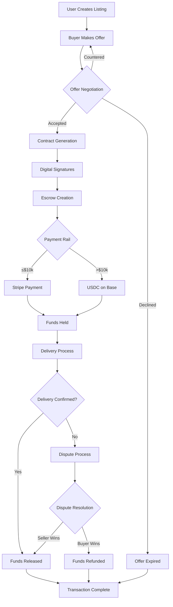
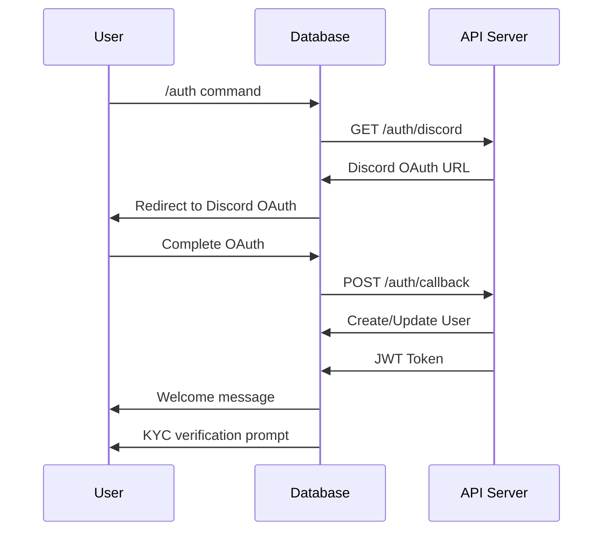
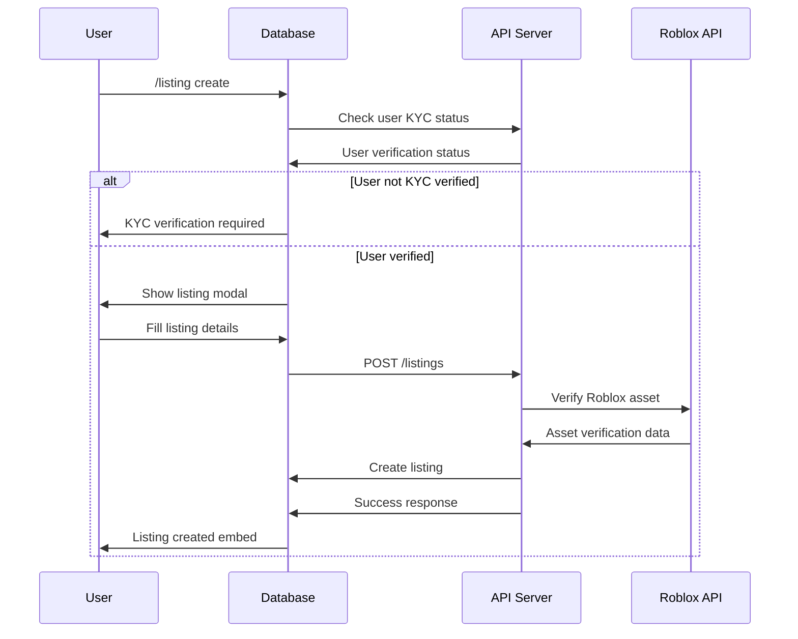
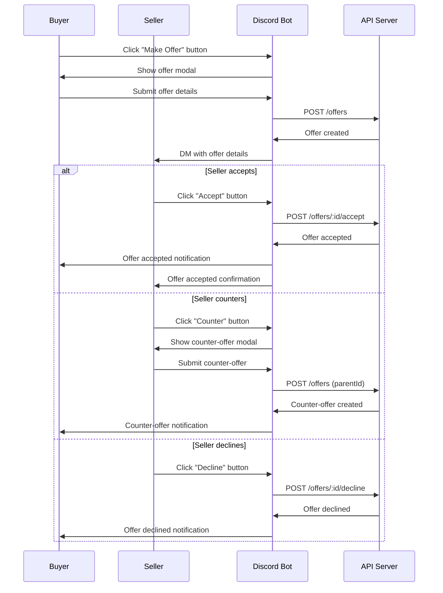
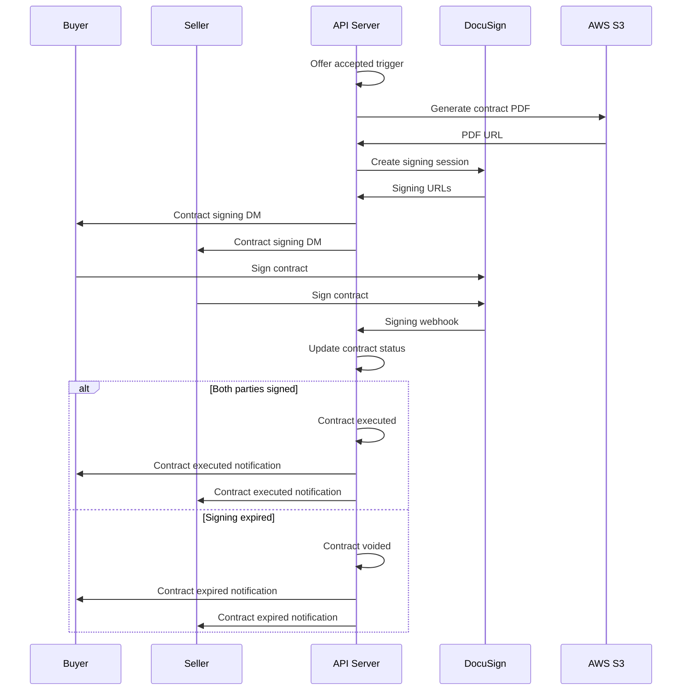
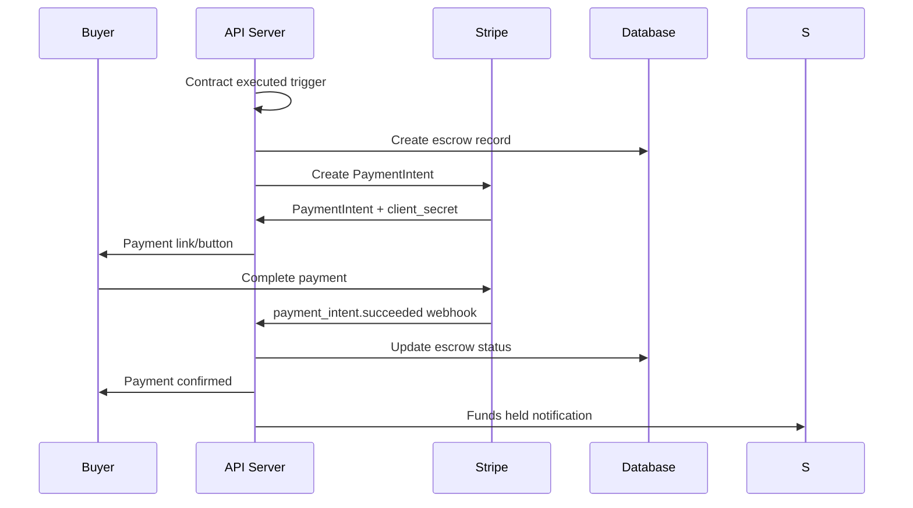
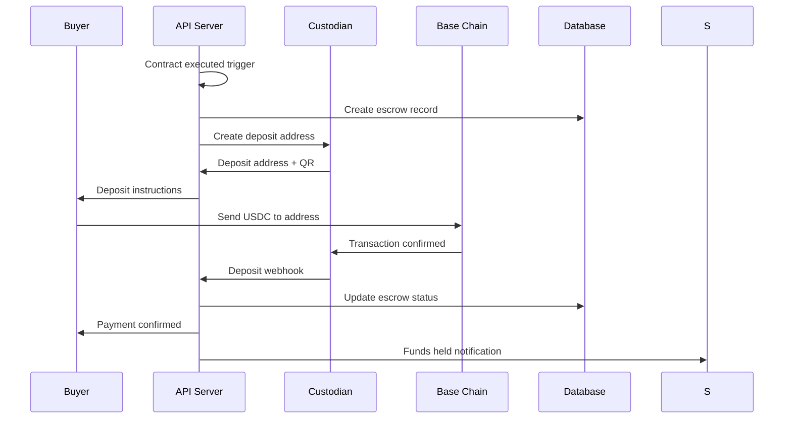
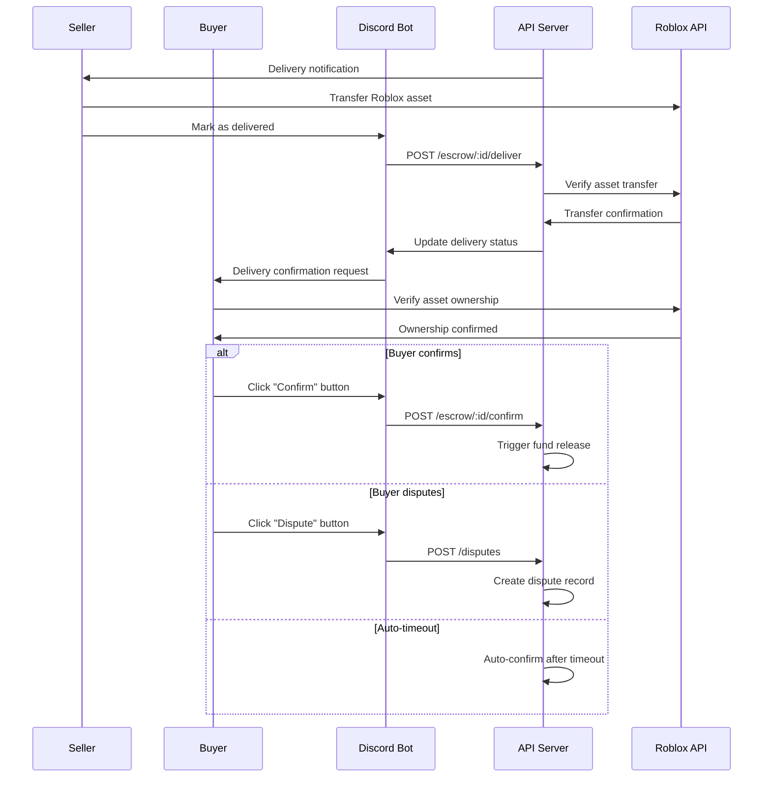
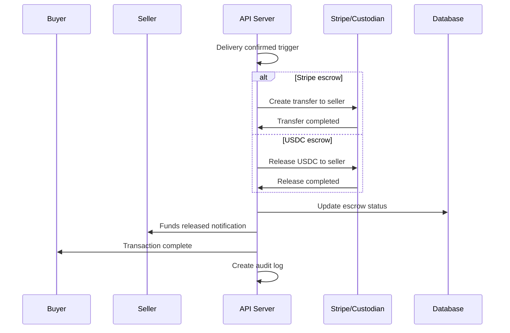
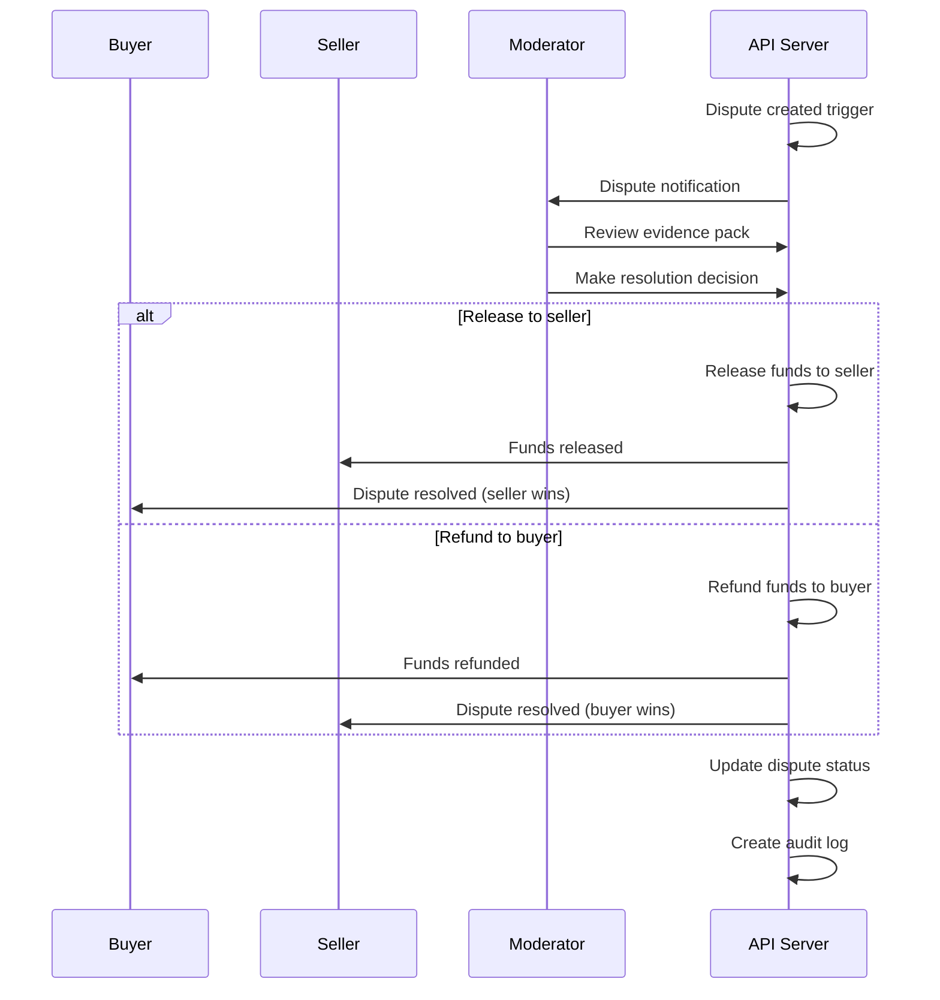

# End-to-End Flows

## Complete Transaction Flow

This document outlines the complete end-to-end flow of a Bloxtr8 transaction, from initial listing creation to final settlement.

## Flow Overview

## Detailed Step-by-Step Flow

### 1. User Onboarding & Verification

**Key Points:**

- Discord OAuth2 integration
- User profile creation/update
- KYC tier assignment
- Wallet screening (if applicable)

### 2. Listing Creation

**Key Points:**

- KYC verification check
- Roblox asset verification
- Modal form for data collection
- Rich embed responses

### 3. Offer Negotiation

**Key Points:**

- Real-time offer notifications
- Counter-offer support
- Automatic expiry handling
- Rich interaction buttons

### 4. Contract Generation & Signing

**Key Points:**

- Automated PDF generation
- DocuSign embedded signing
- Webhook-driven status updates
- Automatic expiry handling

### 5. Escrow Creation & Funding

#### Stripe Path (≤$10k)

#### USDC Path (>$10k)

**Key Points:**

- Dual payment rail support
- Webhook-driven state management
- Real-time status updates
- Automatic timeout handling

### 6. Delivery Process

**Key Points:**

- Roblox asset verification
- Confirmation/dispute options
- Automatic timeout handling
- Asset ownership verification

### 7. Fund Release & Settlement

#### Successful Release

#### Dispute Resolution

**Key Points:**

- Automated fund release
- Dispute resolution workflow
- Comprehensive audit logging
- Multi-rail settlement support

## Error Handling & Edge Cases

### Common Error Scenarios

1. **Payment Failures**
   - Stripe payment declined
   - USDC transaction failed
   - Insufficient funds

2. **Contract Issues**
   - Signing timeout
   - Invalid signatures
   - PDF generation failure

3. **Delivery Problems**
   - Asset transfer failure
   - Ownership verification issues
   - Disputed deliveries

4. **System Failures**
   - API downtime
   - Database issues
   - External service outages

### Recovery Mechanisms

- **Automatic retries** for transient failures
- **Manual intervention** for complex issues
- **Escalation procedures** for critical problems
- **Audit trails** for all actions
- **Rollback capabilities** where appropriate

## Monitoring & Analytics

### Key Metrics

- **Transaction volume** and value
- **Success rates** by payment rail
- **Dispute rates** and resolution times
- **User satisfaction** scores
- **System performance** metrics

### Alerts & Notifications

- **Failed transactions** requiring attention
- **High dispute rates** indicating issues
- **System performance** degradation
- **Security incidents** or anomalies
- **Compliance violations** or risks

This end-to-end flow ensures a robust, secure, and user-friendly escrow platform that handles the complexities of Discord-native trading while maintaining high security and compliance standards.
