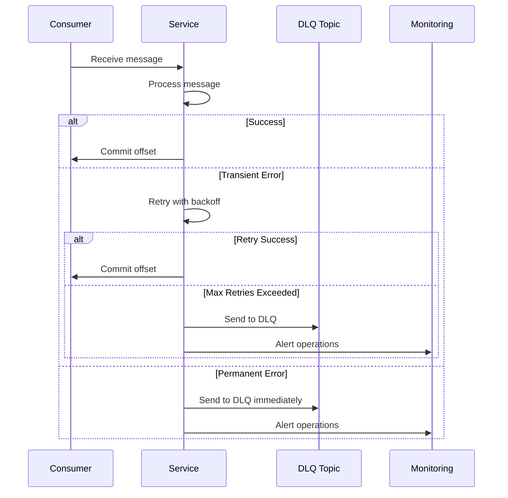

# Error Handling & Retries

Comprehensive error handling strategy, retry mechanisms, dead letter queue (DLQ) management, and recovery procedures.

## Error Classification

### Transient Errors

**Characteristics**:

- Temporary failures that may resolve on retry
- Network timeouts, connection errors
- Rate limiting (with backoff)
- Temporary service unavailability

**Examples**:

- Kafka broker unavailable
- Database connection timeout
- Stripe API rate limit (429)
- Custodian API temporary outage

**Handling**: Retry with exponential backoff

### Permanent Errors

**Characteristics**:

- Failures that won't resolve on retry
- Invalid data, authorization failures
- Business rule violations
- Malformed messages

**Examples**:

- Invalid escrow_id (doesn't exist)
- Unauthorized actor (buyer trying to mark delivered)
- Invalid state transition (release when AWAIT_FUNDS)
- Malformed Protobuf payload

**Handling**: Reject immediately, send to DLQ

### Poison Messages

**Characteristics**:

- Messages that repeatedly fail processing
- Exceed maximum retry count
- Cause consumer to crash

**Examples**:

- Corrupted Protobuf payload
- Circular reference in event data
- Memory exhaustion during processing

**Handling**: Send to DLQ, alert operations team

## Retry Strategy

### Exponential Backoff

**Configuration**:

```
Initial Delay: 100ms
Max Delay: 30 seconds
Backoff Multiplier: 2
Max Retries: 5
```

**Implementation**:

```typescript
function calculateRetryDelay(retryCount: number): number {
  const baseDelay = 100; // milliseconds
  const maxDelay = 30000; // 30 seconds
  const delay = baseDelay * Math.pow(2, retryCount);
  return Math.min(delay, maxDelay);
}
```

### Retry Limits

| Operation          | Max Retries | Backoff Strategy           |
| ------------------ | ----------- | -------------------------- |
| Kafka Consumer     | 5           | Exponential (100ms → 30s)  |
| Stripe API Call    | 3           | Exponential (200ms → 2s)   |
| Custodian API Call | 3           | Exponential (200ms → 2s)   |
| Database Query     | 3           | Exponential (50ms → 500ms) |
| Webhook Processing | 5           | Exponential (100ms → 30s)  |

### Retry Circuit Breaker

**Purpose**: Prevent cascading failures when downstream service is unavailable

**Configuration**:

```
Failure Threshold: 5 failures in 60 seconds
Open State Duration: 30 seconds
Half-Open State: Allow 1 request to test recovery
```

**States**:

- **Closed**: Normal operation, requests pass through
- **Open**: Circuit open, requests fail immediately
- **Half-Open**: Testing recovery, allow limited requests

## Dead Letter Queue (DLQ)

### DLQ Configuration

**Topic Naming**: `{topic}.dlq`

**Retention**: 30 days

**Partitioning**: Same as source topic (preserve ordering)

**Schema**: Enriched with error metadata

### DLQ Message Structure

```protobuf
message DLQMessage {
  string original_topic = 1;
  string original_partition = 2;
  int64 original_offset = 3;
  bytes original_payload = 4;
  string error_type = 5;              // "TRANSIENT" | "PERMANENT" | "POISON"
  string error_message = 6;
  int32 retry_count = 7;
  string failed_at = 8;                // ISO 8601 timestamp
  string trace_id = 9;
  map<string, string> metadata = 10;   // Additional context
}
```

### DLQ Processing Flow



### DLQ Monitoring

**Metrics**:

- DLQ message count per topic
- DLQ message rate (messages/hour)
- Oldest message age in DLQ
- Error type distribution

**Alerts**:

- DLQ message count > 0 → Alert (investigate)
- DLQ message count > 100 → Pager alert (urgent)
- DLQ message age > 7 days → Alert (stale messages)

## Idempotency Guarantees

### Event Deduplication

**Storage**: `EscrowEvent` table with unique index on `event_id`

**Process**:

1. Extract `event_id` from incoming event
2. Check if `event_id` exists in database
3. If exists: Skip processing (already handled)
4. If not: Process event + insert event record

**Implementation**:

```sql
CREATE TABLE escrow_event (
  id UUID PRIMARY KEY,
  escrow_id VARCHAR(255) NOT NULL,
  event_id VARCHAR(255) UNIQUE NOT NULL,
  event_type VARCHAR(255) NOT NULL,
  payload JSONB NOT NULL,
  occurred_at TIMESTAMP NOT NULL,
  INDEX idx_escrow_id (escrow_id),
  INDEX idx_event_id (event_id)
);
```

### Command Deduplication

**Storage**: Outbox table with unique constraint

**Process**:

1. Generate deterministic `event_id` from command
2. Insert into outbox with `event_id` uniqueness check
3. If duplicate: Skip (already queued)

**Key Generation**:

```typescript
function generateCommandEventId(
  escrowId: string,
  commandType: string,
  actorId: string,
  timestamp: string
): string {
  const data = `${escrowId}:${commandType}:${actorId}:${timestamp}`;
  return crypto.createHash('sha256').update(data).digest('hex');
}
```

## Compensation Patterns

### Saga Pattern for Multi-Step Operations

**Use Case**: Release funds involves multiple steps (transfer + state update)

**Compensation**:

- If transfer fails: Rollback state to `DELIVERED`
- If state update fails: Retry transfer (idempotent)

**Implementation**:

```typescript
async function releaseFunds(escrowId: string): Promise<void> {
  const escrow = await getEscrow(escrowId);

  try {
    // Step 1: Create transfer
    const transfer = await createTransfer(escrow);

    // Step 2: Update state
    await updateEscrowState(escrowId, 'RELEASED', transfer.id);

    // Step 3: Emit event
    await emitEvent('EscrowReleased', { escrowId, transferId: transfer.id });
  } catch (error) {
    // Compensation: Rollback transfer if state update fails
    if (transfer && !stateUpdated) {
      await cancelTransfer(transfer.id);
    }
    throw error;
  }
}
```

### Outbox Pattern Compensation

**Problem**: Database transaction commits but Kafka publish fails

**Solution**: Outbox publisher retries indefinitely until published

**Process**:

1. Outbox publisher polls for unpublished events
2. Publishes to Kafka
3. Marks as published only after successful Kafka acknowledgment
4. Retries on failure (with exponential backoff)

## Poison Message Handling

### Detection

**Signals**:

- Consumer crashes repeatedly on same message
- Message processing time > 60 seconds
- Memory usage spike during processing
- Deserialization errors

**Monitoring**:

- Track message processing time
- Alert on consumer crashes
- Monitor deserialization error rate

### Handling

**Process**:

1. Detect poison message (repeated failures)
2. Skip message (don't commit offset)
3. Send to DLQ with error metadata
4. Alert operations team
5. Manually investigate and fix

**Skip Logic**:

```typescript
let consecutiveFailures = 0;
const MAX_CONSECUTIVE_FAILURES = 3;

try {
  await processMessage(message);
  consecutiveFailures = 0;
} catch (error) {
  consecutiveFailures++;

  if (consecutiveFailures >= MAX_CONSECUTIVE_FAILURES) {
    await sendToDLQ(message, error);
    await skipMessage(message); // Don't commit offset
    await alertOperations(message, error);
  } else {
    throw error; // Retry
  }
}
```

## Replay Procedures

### Manual Replay

**Use Case**: Fix data corruption or reprocess events

**Process**:

1. Identify events to replay (by escrow_id, time range, or event type)
2. Query events from Kafka (or event store)
3. Reset consumer offset to target position
4. Replay events through consumer

**Safety**:

- Idempotency ensures no duplicate processing
- Replay in test environment first
- Monitor for errors during replay

### Selective Replay

**Use Case**: Replay events for specific escrow

**Process**:

1. Find escrow_id
2. Query all events for escrow_id from Kafka
3. Filter events by criteria (time range, event type)
4. Replay filtered events

**Implementation**:

```bash
# Replay events for escrow
kafka-console-consumer \
  --topic escrow.events.v1 \
  --partition 0 \
  --offset earliest \
  --property print.key=true \
  --property key.separator=: \
  | grep "escrow_id:esc_123" \
  | kafka-console-producer --topic escrow.events.v1
```

## Error Recovery Scenarios

### Scenario 1: Payment Webhook Lost

**Problem**: Stripe webhook not received, payment succeeded but escrow still AWAIT_FUNDS

**Detection**: Escrow in AWAIT_FUNDS > 24 hours with payment intent created

**Recovery**:

1. Query Stripe API for payment intent status
2. If succeeded: Emit `PaymentSucceeded` event manually
3. Escrow Service processes event normally

**Prevention**: Webhook retry mechanism, periodic reconciliation

### Scenario 2: Transfer Failed After State Update

**Problem**: Escrow state updated to RELEASED but transfer failed

**Detection**: Transfer failed event received after RELEASED state

**Recovery**:

1. Detect transfer failure
2. Rollback escrow state to DELIVERED
3. Retry transfer
4. Update state again on success

**Prevention**: Two-phase commit pattern (state update only after transfer success)

### Scenario 3: Kafka Partition Leader Unavailable

**Problem**: Partition leader crashes, writes fail

**Recovery**:

1. Kafka automatically elects new leader (ISR replication)
2. Outbox publisher retries failed publishes
3. No data loss (events in outbox)

**Prevention**: Multiple Kafka brokers, ISR replication factor >= 2

## Monitoring & Alerting

### Error Metrics

**Key Metrics**:

- Error rate by service and error type
- Retry count distribution
- DLQ message count and rate
- Poison message detection rate

**Dashboards**:

- Error rate trends
- DLQ size over time
- Retry success rate

### Alerts

| Condition               | Severity | Action          |
| ----------------------- | -------- | --------------- |
| DLQ message count > 0   | Warning  | Investigate     |
| DLQ message count > 100 | Critical | Pager alert     |
| Error rate > 1%         | Warning  | Investigate     |
| Error rate > 5%         | Critical | Pager alert     |
| Poison message detected | Critical | Pager alert     |
| Consumer lag > 1000     | Warning  | Scale consumers |

## Related Documentation

- [Observability](./observability.md) - Metrics and monitoring
- [State Machine](./state-machine.md) - State transition validation
- [Escrow System Architecture](./escrow-system-architecture.md) - Architecture overview
