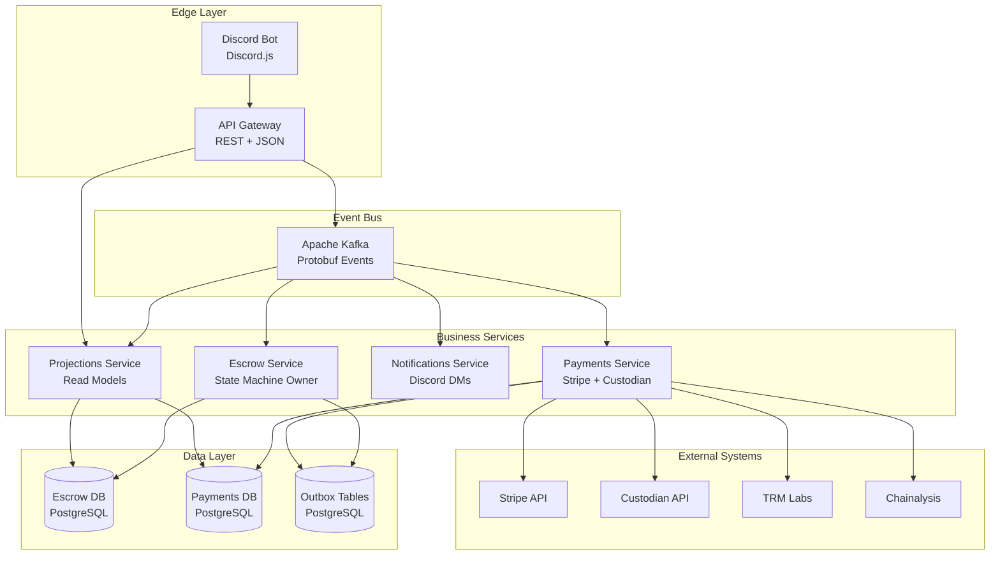
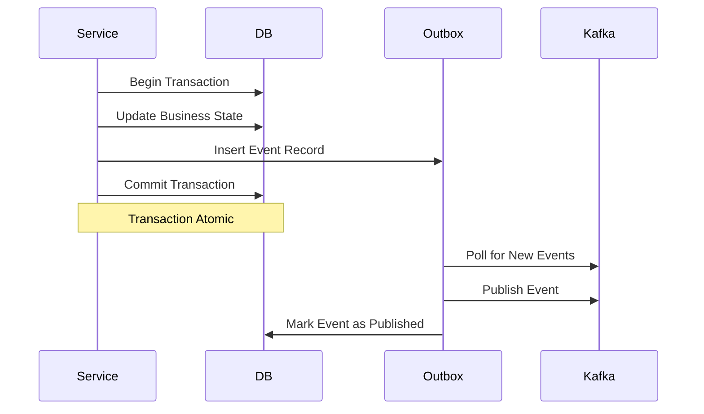

# Escrow System Architecture

## Overview

The Escrow System is an event-driven microservices architecture built on Apache Kafka, designed to handle payment escrow for high-value Roblox game transactions. The system ensures financial consistency, auditability, and compliance while processing $300M+ in annual transaction volume.

## Architecture Principles

- **Event-Driven**: All state changes flow through Kafka events for loose coupling and scalability
- **Consistency First**: Strong consistency for escrow state transitions using transactional outbox pattern
- **Security-First**: Multi-layer security with webhook verification, PCI compliance, and AML screening
- **Idempotency**: All operations are idempotent to handle retries and duplicate events gracefully
- **Observability**: Complete distributed tracing and metrics for production operations

## High-Level Architecture



## Service Boundaries

### API Gateway

**Purpose**: Request validation, authentication, and synchronous query handling

**Responsibilities**:

- Validate incoming REST requests
- Authenticate users (JWT validation)
- Authorize actions (buyer/seller/admin roles)
- Emit commands to Kafka for state changes
- Query read models from Projections Service for GET requests
- Return 202 Accepted for async operations with resource links

**Technology**:

- Express.js with TypeScript
- Better Auth for authentication
- Kafka producer for command emission

**Communication**:

- **Inbound**: REST + JSON (Discord Bot, Web App)
- **Outbound**: Kafka commands (Protobuf)

### Escrow Service

**Purpose**: Escrow state machine owner and business logic coordinator

**Responsibilities**:

- Maintain escrow state machine (AWAIT_FUNDS → FUNDS_HELD → DELIVERED → RELEASED)
- Process escrow commands (CreateEscrow, MarkDelivered, ReleaseFunds, CancelEscrow)
- Emit escrow domain events (EscrowCreated, EscrowFundsHeld, EscrowDelivered, EscrowReleased)
- Enforce state transition guards and business rules
- Handle idempotency for all state transitions
- Coordinate with Payments Service for payment operations

**Technology**:

- Node.js/TypeScript service
- PostgreSQL for escrow state storage
- Kafka consumer for commands
- Kafka producer for events (via outbox pattern)

**Data Model**:

- `Escrow` table: Source of truth for escrow state
- `EscrowEvent` table: Append-only audit log
- Outbox table: Transactional event publishing

**Communication**:

- **Inbound**: Kafka commands (Protobuf)
- **Outbound**: Kafka events (Protobuf)

### Payments Service

**Purpose**: Payment provider integration and payment orchestration

**Responsibilities**:

- Process payment commands (CreatePaymentIntent, TransferToSeller, InitiateRefund)
- Integrate with Stripe API (≤$10k transactions)
- Integrate with Custodian API (USDC on Base, >$10k transactions)
- Verify webhook signatures from payment providers
- Screen wallets via TRM Labs and Chainalysis for USDC payments
- Emit payment events (PaymentSucceeded, TransferSucceeded, RefundSucceeded)
- Handle payment retries and failures

**Technology**:

- Node.js/TypeScript service
- PostgreSQL for payment artifacts
- Stripe SDK
- Custodian REST API client
- Kafka consumer for commands
- Kafka producer for events (via outbox pattern)

**Data Model**:

- `PaymentArtifact` table: Payment provider transaction records
- `WebhookEvent` table: Processed webhook idempotency
- Outbox table: Transactional event publishing

**Communication**:

- **Inbound**: Kafka commands (Protobuf), Webhook HTTP (JSON)
- **Outbound**: Kafka events (Protobuf)
- **External**: Stripe API, Custodian API, TRM Labs API, Chainalysis API

### Notifications Service

**Purpose**: User notifications via Discord and other channels

**Responsibilities**:

- Subscribe to escrow and payment events
- Send Discord DMs for state changes
- Send web notifications (future)
- Manage notification preferences
- Handle notification failures gracefully

**Technology**:

- Node.js/TypeScript service
- Discord.js SDK
- Kafka consumer for events

**Communication**:

- **Inbound**: Kafka events (Protobuf)
- **Outbound**: Discord API

### Projections Service

**Purpose**: Build and maintain read-optimized views for queries

**Responsibilities**:

- Subscribe to escrow and payment events
- Build denormalized read models
- Handle projection rebuilds on schema changes
- Serve read queries from API Gateway

**Technology**:

- Node.js/TypeScript service
- PostgreSQL for read models
- Kafka consumer for events

**Communication**:

- **Inbound**: Kafka events (Protobuf)
- **Outbound**: REST API (internal) or direct DB queries

## Communication Patterns

### Edge Communication (API Gateway)

**Protocol**: REST + JSON
**Rationale**:

- Browser and Discord Bot compatibility
- Standard HTTP semantics
- Easy debugging and integration
- CDN-friendly for static assets

**Request Flow**:

```
User → API Gateway (REST)
  ↓
API Gateway validates request
  ↓
For mutations: Emit Kafka command → Return 202 Accepted
For queries: Query Projections Service → Return 200 OK
```

### Internal Communication (Services)

**Protocol**: Kafka + Protobuf
**Rationale**:

- Small payload size (critical for high-throughput)
- Strong schema evolution via Schema Registry
- Type safety across services
- Backward compatibility guarantees
- Partitioning enables ordering guarantees

**Command Pattern**:

```
API Gateway → Kafka Command Topic → Service Consumer
```

**Event Pattern**:

```
Service → Kafka Event Topic → Multiple Consumers
```

## Kafka Architecture

### Cluster Configuration

**Brokers**: Minimum 3 brokers for high availability
**Replication Factor**: 3 (production), 1 (development)
**Minimum In-Sync Replicas (ISR)**: 2
**Partition Strategy**: Keyed by `escrow_id` for ordering guarantees

### Topic Naming Convention

Format: `{domain}.{type}.v{version}`

Examples:

- `escrow.commands.v1` - Escrow commands
- `escrow.events.v1` - Escrow domain events
- `payments.commands.v1` - Payment commands
- `payments.events.v1` - Payment events
- `webhook.events.v1` - Validated webhook events

### Partitioning Strategy

**Key**: `escrow_id` (for escrow-related topics)
**Key**: `provider_payment_id` (for payment webhook topics)

**Rationale**:

- All events for a single escrow processed in order
- Enables idempotent processing per escrow
- Scales horizontally by escrow volume
- Maintains causal ordering within escrow lifecycle

**Partition Count**:

- Initial: 12 partitions per topic (supports 12 concurrent consumers)
- Scaling: Increase partitions as throughput grows (consider rebalancing impact)

### Retention Policy

**Commands**: 7 days (short-lived, consumed immediately)
**Events**: 90 days (for reprocessing and audit)
**DLQ**: 30 days (requires manual review)

**Compaction**: Enabled for event topics (key-based deduplication)

## Outbox Pattern

### Problem

Direct Kafka publishing from database transactions creates consistency issues:

- Database transaction commits but Kafka publish fails → inconsistent state
- Database transaction rolls back but Kafka message sent → orphaned events

### Solution

Transactional Outbox Pattern ensures atomicity:



### Implementation

**Outbox Table Schema**:

```sql
CREATE TABLE outbox (
  id UUID PRIMARY KEY DEFAULT gen_random_uuid(),
  aggregate_id VARCHAR(255) NOT NULL,
  event_type VARCHAR(255) NOT NULL,
  payload BYTEA NOT NULL, -- Protobuf serialized
  created_at TIMESTAMP NOT NULL DEFAULT NOW(),
  published_at TIMESTAMP,
  version INTEGER NOT NULL DEFAULT 1,
  INDEX idx_unpublished (published_at) WHERE published_at IS NULL
);
```

**Publishing Process**:

1. Service writes business state + outbox record in single transaction
2. Separate outbox publisher process polls for unpublished events
3. Publisher deserializes Protobuf payload and publishes to Kafka
4. Publisher marks event as published (with idempotency check)

**Idempotency**: Event ID generated deterministically from business state to prevent duplicates

## Data Consistency Guarantees

### Strong Consistency

**Escrow State Transitions**:

- Single writer (Escrow Service) per escrow
- Partition key ensures ordering
- Database transactions ensure atomicity
- Outbox ensures event publishing atomicity

**Payment State**:

- Idempotent webhook processing via `WebhookEvent` table
- Single payment artifact per provider transaction ID

### Eventually Consistent

**Read Models (Projections)**:

- Built asynchronously from events
- May lag by milliseconds to seconds
- Eventual consistency acceptable for queries
- Strong consistency for mutations via command pattern

**Notifications**:

- Fire-and-forget (best effort)
- Retries for transient failures
- Dead letter queue for permanent failures

## Technology Stack

### Event Bus

- **Apache Kafka**: 3.5+ with KRaft mode
- **Schema Registry**: Confluent Schema Registry for Protobuf schema management
- **Protobuf**: Protocol Buffers v3 for serialization

### Services

- **Runtime**: Node.js 20+ with TypeScript
- **Framework**: Express.js for API Gateway
- **Database**: PostgreSQL 14+ with Prisma ORM
- **Authentication**: Better Auth

### External Integrations

- **Stripe**: Payment processing (≤$10k)
- **Custodian**: USDC custody (Base network)
- **TRM Labs**: Wallet risk screening
- **Chainalysis**: Sanctions screening

## Performance Considerations

### Latency SLOs

- **Command → Event**: < 100ms (p95)
- **Webhook → Event**: < 500ms (p95)
- **Query Response**: < 50ms (p95)

### Throughput Targets

- **Commands**: 1,000 commands/second
- **Events**: 5,000 events/second
- **Queries**: 10,000 queries/second

### Scaling Strategy

- **Horizontal Scaling**: All services stateless, scale via consumer groups
- **Database Scaling**: Read replicas for projections
- **Kafka Scaling**: Add partitions as needed (with rebalancing consideration)

## Security Architecture

### Authentication & Authorization

- **API Gateway**: JWT validation via Better Auth
- **Kafka**: SASL/SCRAM authentication
- **Schema Registry**: TLS + authentication

### Data Protection

- **In Transit**: TLS 1.3 for all communications
- **At Rest**: Database encryption, KMS for secrets
- **Event Payloads**: No PII in events (user IDs only, no emails/addresses)

### Audit Trail

- **EscrowEvent**: Append-only log of all state changes
- **WebhookEvent**: All webhook processing logged
- **AuditLog**: Complete user action history

## Disaster Recovery

### Kafka Resilience

- **Replication**: 3x replication across availability zones
- **ISR**: Minimum 2 in-sync replicas for write acknowledgment
- **Backup**: Regular topic snapshots (if required)

### Database Resilience

- **Backups**: Daily automated backups with 30-day retention
- **Point-in-Time Recovery**: Enabled for production databases
- **Failover**: Read replicas for query load distribution

### Recovery Procedures

1. **Kafka Corruption**: Replay events from database outbox
2. **Database Corruption**: Restore from backup + replay events
3. **Service Failure**: Auto-restart with exponential backoff

## Monitoring & Observability

See [Observability](./observability.md) for detailed metrics, tracing, and logging strategy.

## Related Documentation

- [Topic Catalog](./topic-catalog.md) - Complete Kafka topic inventory
- [Event Schemas](./event-schemas.md) - Protobuf schema definitions
- [State Machine](./state-machine.md) - Escrow state transitions
- [Sequence Flows](./sequence-flows.md) - Detailed flow diagrams
- [Error Handling](./error-handling-retries.md) - Retry and DLQ strategies
- [Security & Compliance](./security-compliance.md) - Security requirements
