# Sequence Flows

Detailed sequence diagrams for all escrow flows, showing Kafka event interactions between services.

## Contract Executed → Escrow Creation Flow

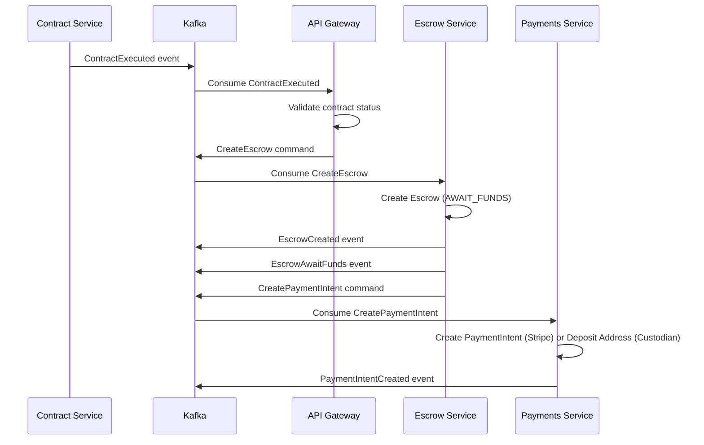

**Key Points**:

- Contract execution triggers escrow creation
- Escrow Service owns escrow state
- Payments Service handles payment provider integration
- All state changes emit events for other services

## Stripe Payment Flow

### Payment Initiation

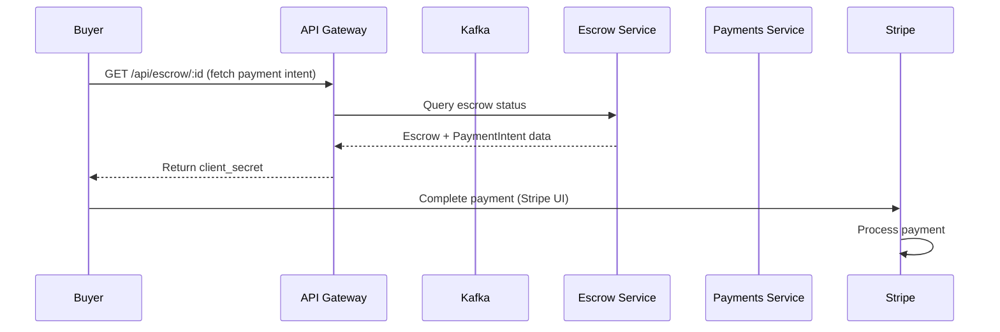

### Payment Completion (Webhook)

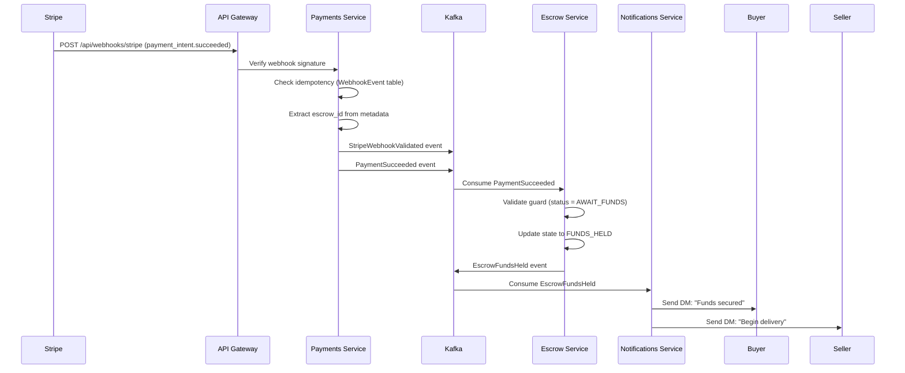

**Key Points**:

- Webhook signature verification before processing
- Idempotency check prevents duplicate processing
- Escrow state transition triggered by payment event
- Notifications sent asynchronously

## USDC Payment Flow (Custodian)

### Deposit Address Generation

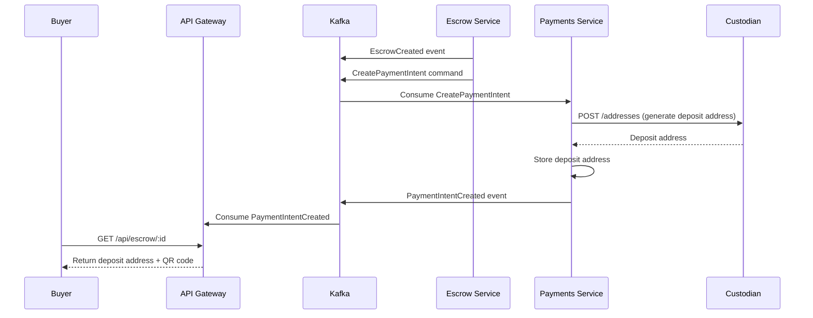

### Deposit Confirmation

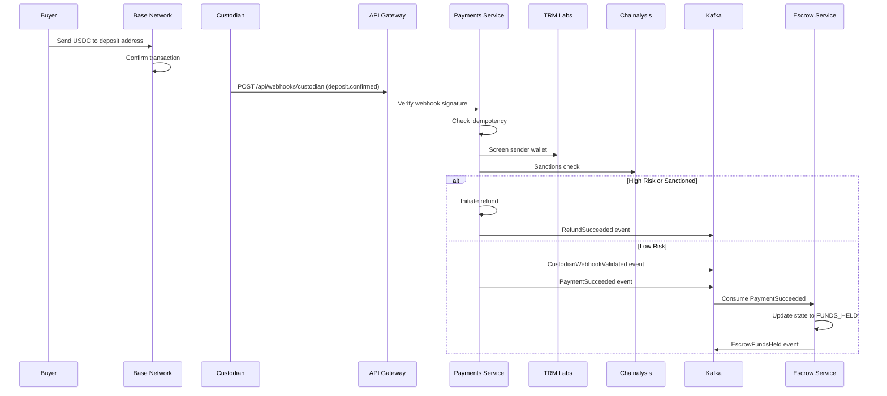

**Key Points**:

- Wallet screening before accepting funds
- Automatic refund for high-risk wallets
- Same event flow as Stripe after screening passes

## Delivery Flow

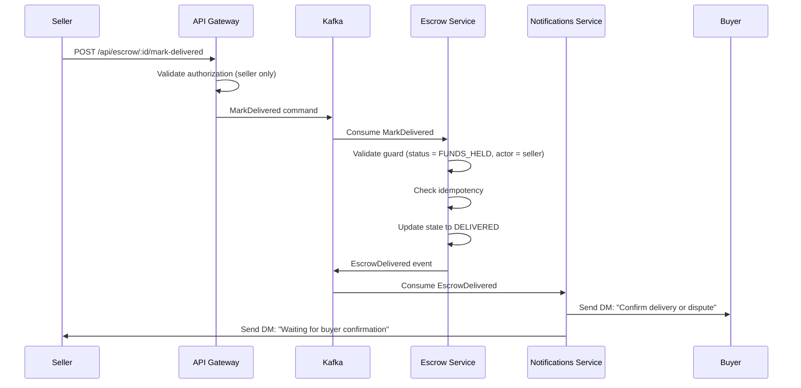

**Key Points**:

- Authorization check: Only seller can mark delivered
- State guard: Must be FUNDS_HELD
- Notification sent to buyer with action buttons

## Release Flow (Stripe)

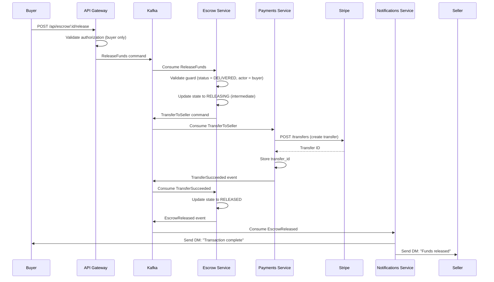

**Key Points**:

- Authorization check: Only buyer can release
- Two-step process: Release command → Transfer command → Transfer succeeded
- Notifications sent to both parties

## Release Flow (USDC)

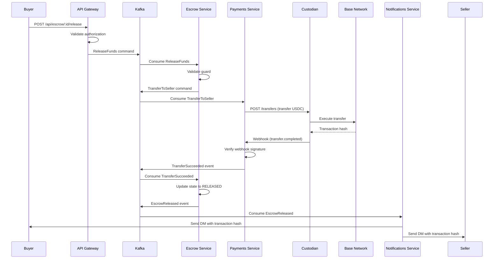

**Key Points**:

- Similar flow to Stripe but uses blockchain
- Transaction hash included in notifications
- Webhook confirms blockchain confirmation

## Refund Flow

### Timeout Refund

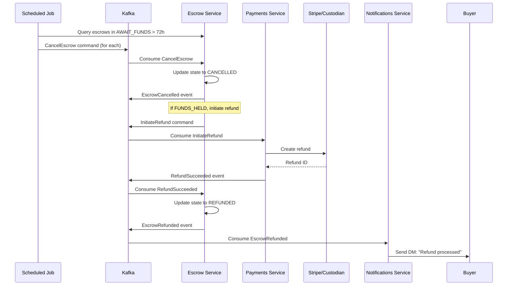

### Dispute Refund

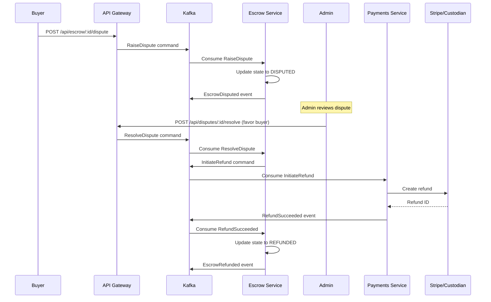

**Key Points**:

- Refunds can be triggered by timeout, cancellation, or dispute resolution
- Payments Service handles provider-specific refund logic
- Escrow Service coordinates state transitions

## Dispute Flow

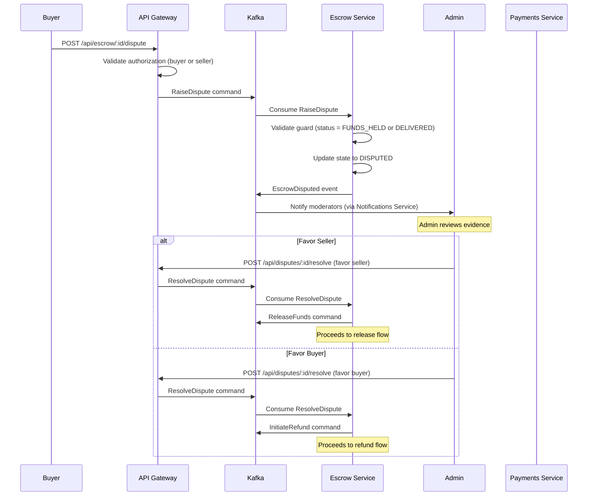

**Key Points**:

- Disputes can be raised by buyer or seller
- Admin resolution triggers either release or refund
- State transition depends on resolution outcome

## Error Handling Flow

### Payment Failure

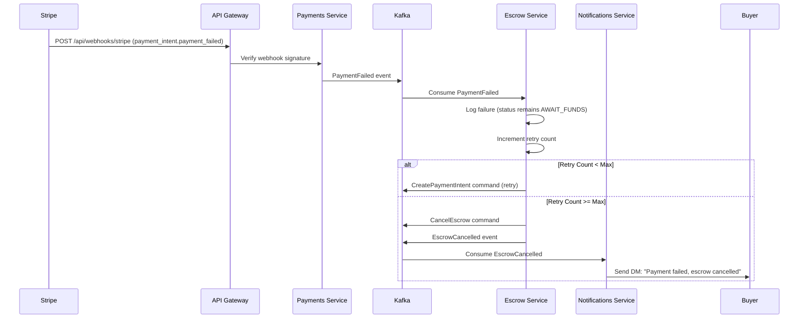

### Transfer Failure

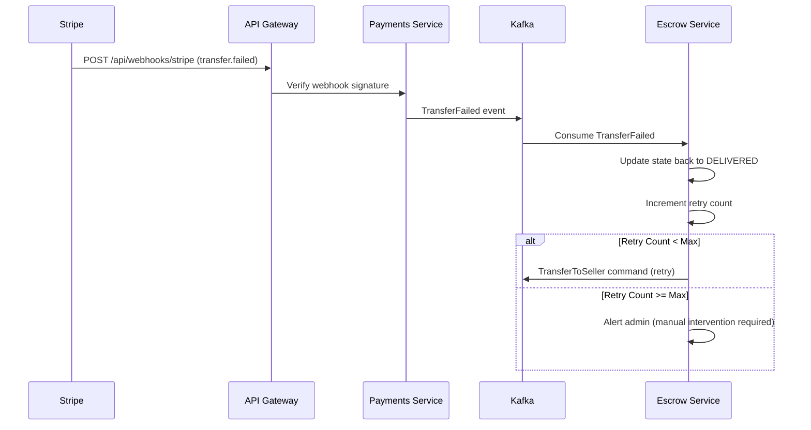

**Key Points**:

- Failures trigger retries with exponential backoff
- Maximum retry count prevents infinite loops
- Manual intervention required for persistent failures

## Complete Flow Summary

### Happy Path (Stripe)

```
ContractExecuted
  → CreateEscrow
  → EscrowCreated + EscrowAwaitFunds
  → CreatePaymentIntent
  → PaymentIntentCreated
  → [User pays via Stripe UI]
  → StripeWebhookValidated
  → PaymentSucceeded
  → EscrowFundsHeld
  → MarkDelivered
  → EscrowDelivered
  → ReleaseFunds
  → TransferToSeller
  → TransferSucceeded
  → EscrowReleased
```

### Happy Path (USDC)

```
ContractExecuted
  → CreateEscrow
  → EscrowCreated + EscrowAwaitFunds
  → CreatePaymentIntent
  → PaymentIntentCreated (deposit address)
  → [User sends USDC]
  → CustodianWebhookValidated
  → Wallet Screening (TRM + Chainalysis)
  → PaymentSucceeded
  → EscrowFundsHeld
  → MarkDelivered
  → EscrowDelivered
  → ReleaseFunds
  → TransferToSeller
  → TransferSucceeded
  → EscrowReleased
```

## Related Documentation

- [State Machine](./state-machine.md) - State transition definitions
- [Event Schemas](./event-schemas.md) - Event structure details
- [Error Handling](./error-handling-retries.md) - Retry and recovery strategies
