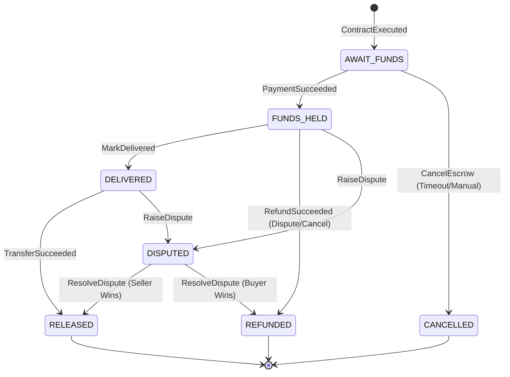
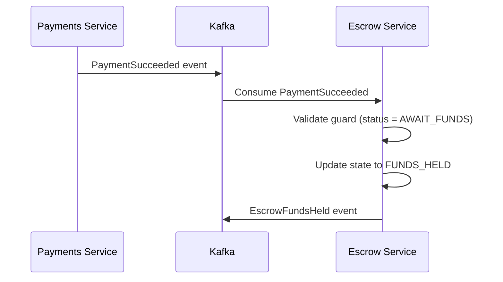

# Escrow State Machine

Complete specification of escrow state transitions, guards, idempotency rules, and state ownership.

## State Diagram



## State Definitions

### AWAIT_FUNDS

**Description**: Escrow created, waiting for buyer payment.

**Entry Conditions**:

- Contract executed (both parties signed)
- Escrow record created
- Payment intent created (Stripe) or deposit address generated (Custodian)

**Allowed Transitions**:

- → `FUNDS_HELD`: Payment received and verified
- → `CANCELLED`: Timeout or manual cancellation

**Guard**: None (initial state)

**Events Emitted**:

- `EscrowCreated`
- `EscrowAwaitFunds`
- `PaymentIntentCreated`

**Timeout**: 72 hours (configurable)

- Auto-transition to `CANCELLED` if no payment received
- Emit `EscrowCancelled` with reason `TIMEOUT`

### FUNDS_HELD

**Description**: Payment received, funds secured in escrow account.

**Entry Conditions**:

- Payment webhook received and validated
- Payment provider confirms funds received
- For USDC: Wallet screening passed (TRM Labs + Chainalysis)

**Allowed Transitions**:

- → `DELIVERED`: Seller marks as delivered
- → `REFUNDED`: Refund initiated (dispute resolution or cancellation)
- → `DISPUTED`: Buyer raises dispute

**Guard**:

- Payment must be confirmed by provider
- Escrow status must be `AWAIT_FUNDS`

**Events Emitted**:

- `EscrowFundsHeld`

**Idempotency**:

- Deduplicate by `provider_payment_id` + `escrow_id`
- Multiple `PaymentSucceeded` events for same payment ignored

### DELIVERED

**Description**: Seller has marked assets as delivered to buyer.

**Entry Conditions**:

- Escrow status is `FUNDS_HELD`
- Seller submits `MarkDelivered` command
- Actor ID matches `escrow.seller_id`

**Allowed Transitions**:

- → `RELEASED`: Buyer confirms and funds released
- → `DISPUTED`: Buyer raises dispute

**Guard**:

- `actor_id` must match `escrow.seller_id`
- Escrow status must be `FUNDS_HELD`

**Events Emitted**:

- `EscrowDelivered`

**Idempotency**:

- Deduplicate by `event_id` from `MarkDelivered` command
- Multiple deliveries for same escrow ignored

**Timeout**: 7 days (configurable)

- Auto-release if buyer doesn't confirm or dispute
- Emit `EscrowReleased` with reason `AUTO_RELEASE`

### RELEASED

**Description**: Funds transferred to seller, transaction complete.

**Entry Conditions**:

- Escrow status is `DELIVERED`
- Transfer command executed successfully
- Payment provider confirms transfer

**Allowed Transitions**: None (terminal state)

**Guard**:

- Escrow status must be `DELIVERED` or `DISPUTED` (if resolved in seller's favor)
- Transfer must succeed

**Events Emitted**:

- `EscrowReleased`
- `TransferSucceeded`

**Idempotency**:

- Deduplicate by `transfer_id` from provider
- Multiple transfers for same escrow rejected (already released)

### REFUNDED

**Description**: Funds refunded to buyer, transaction cancelled.

**Entry Conditions**:

- Escrow status is `FUNDS_HELD` or `DISPUTED`
- Refund initiated (dispute resolution, cancellation, or AML failure)
- Payment provider confirms refund

**Allowed Transitions**: None (terminal state)

**Guard**:

- Escrow status must be `FUNDS_HELD`, `DISPUTED`, or `DELIVERED` (rare)
- Refund must succeed

**Events Emitted**:

- `EscrowRefunded`
- `RefundSucceeded`

**Idempotency**:

- Deduplicate by `refund_id` from provider
- Multiple refunds for same escrow rejected (already refunded)

### CANCELLED

**Description**: Escrow cancelled before funds received.

**Entry Conditions**:

- Escrow status is `AWAIT_FUNDS`
- Timeout expired OR manual cancellation

**Allowed Transitions**: None (terminal state)

**Guard**:

- Escrow status must be `AWAIT_FUNDS`
- Cannot cancel if funds already held

**Events Emitted**:

- `EscrowCancelled`

**Idempotency**:

- Deduplicate by `event_id` from `CancelEscrow` command

### DISPUTED

**Description**: Buyer or seller raised dispute, awaiting resolution.

**Entry Conditions**:

- Escrow status is `FUNDS_HELD` or `DELIVERED`
- Dispute command received

**Allowed Transitions**:

- → `RELEASED`: Dispute resolved in seller's favor
- → `REFUNDED`: Dispute resolved in buyer's favor

**Guard**:

- Escrow status must be `FUNDS_HELD` or `DELIVERED`
- Cannot dispute if already released or refunded

**Events Emitted**:

- `EscrowDisputed`

**Idempotency**:

- Deduplicate by `event_id` from `RaiseDispute` command

## State Transition Guards

### Generic Guards

All state transitions enforce:

1. **Escrow Exists**: Escrow record must exist in database
2. **Actor Authorization**: User must be authorized for action
   - `MarkDelivered`: Must be seller
   - `ReleaseFunds`: Must be buyer
   - `RaiseDispute`: Must be buyer or seller
   - `ResolveDispute`: Must be admin
3. **Idempotency**: Event ID must not have been processed
4. **State Precondition**: Current state must allow transition

### State-Specific Guards

| From State    | To State     | Guard                                  |
| ------------- | ------------ | -------------------------------------- |
| `AWAIT_FUNDS` | `FUNDS_HELD` | Payment confirmed by provider          |
| `FUNDS_HELD`  | `DELIVERED`  | Actor is seller                        |
| `DELIVERED`   | `RELEASED`   | Actor is buyer OR auto-release timeout |
| `FUNDS_HELD`  | `REFUNDED`   | Refund reason valid                    |
| `DELIVERED`   | `DISPUTED`   | Actor is buyer                         |
| `DISPUTED`    | `RELEASED`   | Resolution favors seller               |
| `DISPUTED`    | `REFUNDED`   | Resolution favors buyer                |

## Idempotency Strategy

### Event ID Generation

**Commands**:

```
event_id = sha256(escrow_id + command_type + actor_id + timestamp)
```

**Events**:

```
event_id = sha256(escrow_id + event_type + business_state_hash + occurred_at)
```

### Deduplication

**Database Table**: `EscrowEvent`

```sql
CREATE TABLE escrow_event (
  id UUID PRIMARY KEY,
  escrow_id VARCHAR(255) NOT NULL,
  event_id VARCHAR(255) UNIQUE NOT NULL,
  event_type VARCHAR(255) NOT NULL,
  payload JSONB NOT NULL,
  occurred_at TIMESTAMP NOT NULL,
  INDEX idx_escrow_id (escrow_id),
  INDEX idx_event_id (event_id)
);
```

**Processing Logic**:

1. Check if `event_id` exists in `EscrowEvent` table
2. If exists: Skip processing (already handled)
3. If not: Process transition + insert event record

### Idempotent Operations

| Operation        | Idempotency Key        | Deduplication Method          |
| ---------------- | ---------------------- | ----------------------------- |
| Payment Received | `provider_payment_id`  | Check `PaymentArtifact` table |
| Mark Delivered   | Command `event_id`     | Check `EscrowEvent` table     |
| Release Funds    | Provider `transfer_id` | Check `PaymentArtifact` table |
| Refund           | Provider `refund_id`   | Check `PaymentArtifact` table |
| Cancel           | Command `event_id`     | Check `EscrowEvent` table     |

## State Ownership

### Escrow Service

**Owns**: All escrow state transitions

**Responsibilities**:

- Validate state transition guards
- Enforce business rules
- Maintain state consistency
- Emit domain events

**State Storage**: PostgreSQL `Escrow` table

### Payments Service

**Owns**: Payment provider state

**Responsibilities**:

- Process payment commands
- Emit payment events (triggers escrow state transitions)
- Handle payment retries

**State Storage**: PostgreSQL `PaymentArtifact` table

### Coordination

Escrow Service consumes `PaymentSucceeded` event → transitions to `FUNDS_HELD`



## Error States

### Invalid State Transitions

**Handling**: Reject command, emit error event, log for monitoring

**Examples**:

- `MarkDelivered` when status is `AWAIT_FUNDS` → Reject
- `ReleaseFunds` when status is `FUNDS_HELD` → Reject
- `CancelEscrow` when status is `RELEASED` → Reject

### Stuck States

**Detection**: Monitoring alerts on escrow age > SLA

**Recovery**:

- `AWAIT_FUNDS` > 72h → Auto-cancel
- `DELIVERED` > 7 days → Auto-release (if no dispute)
- `DISPUTED` > 30 days → Alert admin for manual review

## Timeout Handling

### Timeout Configuration

| State         | Timeout  | Action       | Event Emitted     |
| ------------- | -------- | ------------ | ----------------- |
| `AWAIT_FUNDS` | 72 hours | Cancel       | `EscrowCancelled` |
| `DELIVERED`   | 7 days   | Auto-release | `EscrowReleased`  |

### Timeout Implementation

**Scheduled Job**: Runs every hour

1. Query escrows in `AWAIT_FUNDS` with `created_at` > 72h ago
2. Emit `CancelEscrow` command for each
3. Query escrows in `DELIVERED` with `delivered_at` > 7 days ago
4. Emit `ReleaseFunds` command for each (if no dispute)

## State Machine Validation

### Transition Validation Logic

```typescript
function validateTransition(
  currentState: EscrowStatus,
  targetState: EscrowStatus,
  command: EscrowCommand
): ValidationResult {
  // Check state precondition
  if (!isValidTransition(currentState, targetState)) {
    return { valid: false, reason: 'Invalid state transition' };
  }

  // Check actor authorization
  if (!isAuthorized(command.actor_id, currentState, command.type)) {
    return { valid: false, reason: 'Actor not authorized' };
  }

  // Check idempotency
  if (isEventProcessed(command.event_id)) {
    return { valid: false, reason: 'Event already processed' };
  }

  // Check business rules
  if (!validateBusinessRules(currentState, command)) {
    return { valid: false, reason: 'Business rule violation' };
  }

  return { valid: true };
}
```

## Related Documentation

- [Sequence Flows](./sequence-flows.md) - Detailed flow diagrams with state transitions
- [Event Schemas](./event-schemas.md) - Event structure definitions
- [Error Handling](./error-handling-retries.md) - Error recovery and retry strategies
