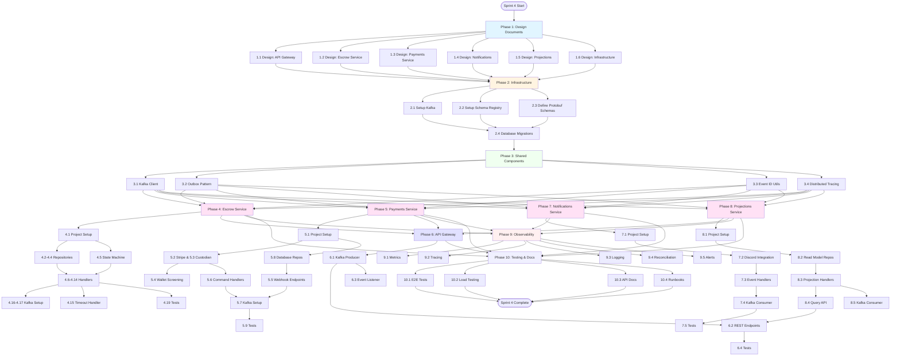

# Sprint 4: Escrow & Payment Integration

**Status**: Planning & Design Phase  
**Goal**: Implement a complete event-driven escrow system using Kafka microservices architecture  
**Timeline**: No fixed timeline - tasks can be worked on concurrently once design is complete

## Overview

Sprint 4 implements the new escrow system architecture as a fresh implementation (no backward compatibility required). The system is built as an event-driven microservices architecture using Apache Kafka for communication between services.

### Key Principles

- **Event-Driven**: All state changes flow through Kafka events
- **Microservices**: Independent services that can be developed concurrently
- **Idempotency**: All operations are idempotent
- **Strong Consistency**: Escrow state transitions use transactional outbox pattern
- **Security First**: Webhook verification, PCI compliance, AML screening

### Architecture Overview

```
API Gateway → Kafka Commands → Escrow Service → Kafka Events → Multiple Consumers
                                     ↓
                            Payments Service
                                     ↓
                            Notifications Service
                                     ↓
                            Projections Service
```

## Task Breakdown

### Phase 1: Design Documents (Foundation)

**Prerequisites**: None  
**Concurrency**: All design tasks can be done in parallel  
**Blocking**: Blocks all implementation phases

#### 1.1 [S4] Design: API Gateway Escrow Integration

**What's this task about**: Create complete design document for API Gateway escrow integration that will serve as the blueprint for implementation.

**Tasks**:

- REST API endpoints specification
- Authentication/authorization flows
- Command emission patterns
- Read model query patterns
- Error handling and validation
- OpenAPI/Swagger documentation

**Deliverables**:

- Design document at `documentation/design/escrow/api-gateway-design.md`
- All API endpoints specified
- Authentication/authorization flows documented
- Command emission patterns documented
- Read model query patterns documented
- Error handling and validation documented
- OpenAPI/Swagger documentation included

**Related Files**: `apps/api/src/routes/escrow.ts`, `apps/api/src/kafka/producer.ts`

---

#### 1.2 [S4] Design: Escrow Service

**What's this task about**: Create complete design document for Escrow Service that will serve as the blueprint for implementation.

**Tasks**:

- State machine implementation details
- Database schema (Escrow, EscrowEvent, Outbox tables)
- Command handlers for all escrow commands
- Event emission patterns
- Idempotency implementation
- State transition guards
- Timeout handling

**Deliverables**:

- Design document at `documentation/design/escrow/escrow-service-design.md`
- State machine implementation details documented
- Database schema documented
- Command handlers documented
- Event emission patterns documented
- Idempotency implementation documented
- State transition guards documented
- Timeout handling documented

**Related Files**: `apps/escrow-service/src/`, `documentation/architecture/escrow/state-machine.md`

---

#### 1.3 [S4] Design: Payments Service

**What's this task about**: Create complete design document for Payments Service that will serve as the blueprint for implementation.

**Tasks**:

- Stripe integration architecture
- Custodian integration architecture
- Webhook processing patterns
- Wallet screening integration (TRM Labs, Chainalysis)
- Payment artifact storage
- Command handlers
- Event emission patterns

**Deliverables**:

- Design document at `documentation/design/escrow/payments-service-design.md`
- Stripe integration architecture documented
- Custodian integration architecture documented
- Webhook processing patterns documented
- Wallet screening integration documented
- Payment artifact storage documented
- Command handlers documented
- Event emission patterns documented

**Related Files**: `apps/payments-service/src/`, `documentation/architecture/payment-system.md`

---

#### 1.4 [S4] Design: Notifications Service

**What's this task about**: Create complete design document for Notifications Service that will serve as the blueprint for implementation.

**Tasks**:

- Discord DM integration
- Event subscription patterns
- Notification templates
- Retry and failure handling
- Notification preferences

**Deliverables**:

- Design document at `documentation/design/escrow/notifications-service-design.md`
- Discord DM integration documented
- Event subscription patterns documented
- Notification templates documented
- Retry and failure handling documented
- Notification preferences documented

**Related Files**: `apps/notifications-service/src/`

---

#### 1.5 [S4] Design: Projections Service

**What's this task about**: Create complete design document for Projections Service that will serve as the blueprint for implementation.

**Tasks**:

- Read model schema design
- Event projection handlers
- Query optimization strategies
- Rebuild procedures
- API Gateway integration patterns

**Deliverables**:

- Design document at `documentation/design/escrow/projections-service-design.md`
- Read model schema design documented
- Event projection handlers documented
- Query optimization strategies documented
- Rebuild procedures documented
- API Gateway integration patterns documented

**Related Files**: `apps/projections-service/src/`

---

#### 1.6 [S4] Design: Infrastructure (Kafka, Schema Registry)

**What's this task about**: Create infrastructure design document for Kafka, Schema Registry, and related infrastructure.

**Tasks**:

- Kafka cluster setup and configuration
- Schema Registry setup
- Topic creation scripts
- Dead Letter Queue configuration
- Monitoring and alerting setup

**Deliverables**:

- Design document at `documentation/design/escrow/infrastructure-design.md`
- Kafka cluster setup and configuration documented
- Schema Registry setup documented
- Topic creation scripts documented
- Dead Letter Queue configuration documented
- Monitoring and alerting setup documented

**Related Files**: `scripts/kafka/`, `documentation/architecture/escrow/topic-catalog.md`

---

### Phase 2: Infrastructure Setup

**Prerequisites**: Phase 1 (Design Documents) complete  
**Concurrency**: Tasks 2.1-2.3 can be done in parallel, 2.4 depends on 2.3  
**Blocking**: Blocks Phase 3-4 (Shared Components and Escrow Service)

#### 2.1 [S4] Infrastructure: Setup Kafka Cluster & Topics

**What's this task about**: Configure Kafka cluster and create all required topics for the escrow event-driven architecture.

**Tasks**:

- Configure Kafka cluster (3 brokers minimum)
- Create topics:
  - `escrow.commands.v1` (12 partitions, 7 days retention)
  - `escrow.events.v1` (12 partitions, 90 days retention, compaction)
  - `payments.commands.v1` (12 partitions, 7 days retention)
  - `payments.events.v1` (12 partitions, 90 days retention, compaction)
  - `webhook.events.v1` (12 partitions, 90 days retention, compaction)
  - `contracts.events.v1` (12 partitions, 90 days retention, compaction)
- Configure partitions (12 per topic)
- Configure replication factor (3 for prod, 1 for dev)
- Configure retention policies
- Configure DLQ topics

**Deliverables**:

- Kafka cluster configured
- All topics created with correct configuration
- Scripts created at `scripts/kafka/setup-topics.sh`
- DLQ topics configured

**Related Files**: `scripts/kafka/setup-topics.sh`, `documentation/architecture/escrow/topic-catalog.md`

---

#### 2.2 [S4] Infrastructure: Setup Schema Registry

**What's this task about**: Install and configure Confluent Schema Registry for managing Protobuf schemas with backward compatibility.

**Tasks**:

- Install and configure Confluent Schema Registry
- Configure Protobuf schema storage
- Setup schema compatibility (BACKWARD)
- Create schema validation rules

**Deliverables**:

- Schema Registry installed and configured
- Protobuf schema storage configured
- Schema compatibility set to BACKWARD
- Schema validation rules created
- Scripts created at `scripts/kafka/setup-schema-registry.sh`

**Related Files**: `scripts/kafka/setup-schema-registry.sh`

---

#### 2.3 [S4] Infrastructure: Define Protobuf Schemas

**What's this task about**: Create Protobuf schema definitions for all commands and events in the escrow system.

**Tasks**:

- Create protobuf schema definitions for all commands:
  - `CreateEscrow`
  - `MarkDelivered`
  - `ReleaseFunds`
  - `CancelEscrow`
  - `RaiseDispute`
  - `ResolveDispute`
  - `CreatePaymentIntent`
  - `TransferToSeller`
  - `InitiateRefund`
- Create protobuf schema definitions for all events:
  - `EscrowCreated`, `EscrowAwaitFunds`, `EscrowFundsHeld`, `EscrowDelivered`, `EscrowReleased`, `EscrowCancelled`, `EscrowDisputed`, `EscrowRefunded`
  - `PaymentIntentCreated`, `PaymentSucceeded`, `PaymentFailed`
  - `TransferSucceeded`, `TransferFailed`
  - `RefundSucceeded`, `RefundFailed`
- Register schemas in Schema Registry
- Generate TypeScript types from schemas

**Deliverables**:

- All command schemas defined
- All event schemas defined
- Schemas registered in Schema Registry
- TypeScript types generated
- Location: `packages/protobuf-schemas/`

**Related Files**: `packages/protobuf-schemas/`, `documentation/architecture/escrow/event-schemas.md`

---

#### 2.4 [S4] Infrastructure: Database Schema Migrations

**What's this task about**: Create all required database tables for the escrow system.

**Tasks**:

- Create Escrow table migration
- Create EscrowEvent table migration
- Create Outbox table migration
- Create PaymentArtifact table migration
- Create WebhookEvent table migration
- Create read model tables for Projections Service

**Deliverables**:

- All migrations created
- Migrations tested
- Location: `packages/database/prisma/migrations/`

**Related Files**: `packages/database/prisma/migrations/`, `documentation/architecture/database-schema.md`

---

### Phase 3: Shared Components

**Prerequisites**: Phase 2 (Infrastructure) complete  
**Concurrency**: All tasks can be done in parallel  
**Blocking**: Blocks Phase 4-8 (All service implementations)

#### 3.1 [S4] Shared: Kafka Client Library

**What's this task about**: Build a shared Kafka client library that can be used by all services for producing and consuming messages.

**Tasks**:

- Create reusable Kafka producer client
- Create reusable Kafka consumer client
- Implement connection pooling
- Implement retry logic
- Implement error handling

**Deliverables**:

- Kafka producer client implemented
- Kafka consumer client implemented
- Connection pooling implemented
- Retry logic implemented
- Error handling implemented
- Location: `packages/kafka-client/`

**Related Files**: `packages/kafka-client/`

---

#### 3.2 [S4] Shared: Outbox Pattern Implementation

**What's this task about**: Create outbox publisher service that ensures events are published reliably even if Kafka is temporarily unavailable.

**Tasks**:

- Create outbox publisher service
- Implement polling mechanism
- Implement idempotent publishing
- Implement error handling and DLQ

**Deliverables**:

- Outbox publisher service implemented
- Polling mechanism implemented
- Idempotent publishing implemented
- Error handling and DLQ implemented
- Location: `packages/outbox-publisher/`

**Related Files**: `packages/outbox-publisher/`, `documentation/architecture/escrow/escrow-system-architecture.md#outbox-pattern`

---

#### 3.3 [S4] Shared: Event ID Generation Utilities

**What's this task about**: Implement utilities to generate deterministic event IDs and check for idempotency.

**Tasks**:

- Create deterministic event ID generation
- Implement idempotency checking utilities

**Deliverables**:

- Event ID generation implemented
- Idempotency checking utilities implemented
- Location: `packages/shared/src/event-utils.ts`

**Related Files**: `packages/shared/src/event-utils.ts`, `documentation/architecture/escrow/state-machine.md#idempotency-strategy`

---

#### 3.4 [S4] Shared: Distributed Tracing Setup

**What's this task about**: Implement distributed tracing to track requests across all services in the escrow system.

**Tasks**:

- Setup tracing context propagation
- Create tracing utilities for Kafka messages
- Create tracing middleware for HTTP

**Deliverables**:

- Tracing context propagation implemented
- Kafka tracing utilities implemented
- HTTP tracing middleware implemented
- Location: `packages/tracing/`

**Related Files**: `packages/tracing/`, `documentation/architecture/escrow/observability.md`

---

### Phase 4: Escrow Service Implementation

**Prerequisites**: Phase 3 (Shared Components) complete  
**Concurrency**: Many tasks can be done in parallel (see flowchart)  
**Blocking**: Blocks Phase 5-6 (Payments Service and API Gateway integration)

#### 4.1 [S4] Escrow Service: Project Setup

**What's this task about**: Setup the foundation for the Escrow Service project.

**Tasks**:

- Create new `apps/escrow-service` directory structure
- Setup package.json with dependencies
- Setup TypeScript configuration
- Setup Docker configuration

**Deliverables**:

- Directory structure created at `apps/escrow-service/`
- package.json configured with all dependencies
- TypeScript configuration complete
- Docker configuration complete

**Related Files**: `apps/escrow-service/`

---

#### 4.2 [S4] Escrow Service: Escrow Repository

**What's this task about**: Create repository layer for escrow database operations with optimistic locking support.

**Tasks**:

- Implement EscrowRepository with Prisma
- Implement optimistic locking
- Implement escrow CRUD operations

**Deliverables**:

- EscrowRepository implemented
- Optimistic locking implemented
- CRUD operations implemented
- Location: `apps/escrow-service/src/repositories/escrow-repository.ts`

**Concurrency**: Can be done in parallel with 4.3-4.4

---

#### 4.3 [S4] Escrow Service: EscrowEvent Repository

**What's this task about**: Create repository for storing escrow events and checking idempotency.

**Tasks**:

- Implement EscrowEventRepository
- Implement idempotency checking
- Implement event storage

**Deliverables**:

- EscrowEventRepository implemented
- Idempotency checking implemented
- Event storage implemented
- Location: `apps/escrow-service/src/repositories/escrow-event-repository.ts`

**Concurrency**: Can be done in parallel with 4.2, 4.4

---

#### 4.4 [S4] Escrow Service: Outbox Repository

**What's this task about**: Create repository for managing outbox table for reliable event publishing.

**Tasks**:

- Implement OutboxRepository
- Implement event insertion
- Implement published event marking

**Deliverables**:

- OutboxRepository implemented
- Event insertion implemented
- Published event marking implemented
- Location: `apps/escrow-service/src/repositories/outbox-repository.ts`

**Concurrency**: Can be done in parallel with 4.2, 4.3

---

#### 4.5 [S4] Escrow Service: State Machine Implementation

**What's this task about**: Create state machine implementation that enforces valid state transitions and guards.

**Tasks**:

- Implement state transition validation
- Implement guard checking
- Implement state transition execution

**Deliverables**:

- State transition validation implemented
- Guard checking implemented
- State transition execution implemented
- Location: `apps/escrow-service/src/state-machine/`

**Dependencies**: Requires 4.2 (Escrow Repository)  
**Concurrency**: Can be done in parallel with 4.3-4.4

---

#### 4.6 [S4] Escrow Service: CreateEscrow Command Handler

**What's this task about**: Handle CreateEscrow commands, create escrow records, and emit events.

**Tasks**:

- Implement CreateEscrow command handler
- Validate command
- Create escrow record
- Emit EscrowCreated event
- Emit EscrowAwaitFunds event
- Emit CreatePaymentIntent command

**Deliverables**:

- CreateEscrow handler implemented
- Command validation implemented
- Escrow record creation implemented
- Events emitted correctly
- Location: `apps/escrow-service/src/handlers/create-escrow.ts`

**Dependencies**: Requires 4.2 (Escrow Repository), 4.3 (EscrowEvent Repository), 4.4 (Outbox Repository), 4.5 (State Machine)

---

#### 4.7 [S4] Escrow Service: MarkDelivered Command Handler

**What's this task about**: Handle MarkDelivered commands from sellers to mark assets as delivered.

**Tasks**:

- Implement MarkDelivered command handler
- Validate actor authorization (seller only)
- Validate state (must be FUNDS_HELD)
- Update escrow state
- Emit EscrowDelivered event

**Deliverables**:

- MarkDelivered handler implemented
- Authorization validation implemented
- State validation implemented
- EscrowDelivered event emitted
- Location: `apps/escrow-service/src/handlers/mark-delivered.ts`

**Dependencies**: Requires 4.2, 4.3, 4.4, 4.5  
**Concurrency**: Can be done in parallel with 4.8-4.11

---

#### 4.8 [S4] Escrow Service: ReleaseFunds Command Handler

**What's this task about**: Handle ReleaseFunds commands from buyers to release funds to sellers.

**Tasks**:

- Implement ReleaseFunds command handler
- Validate actor authorization (buyer only)
- Validate state (must be DELIVERED)
- Emit TransferToSeller command

**Deliverables**:

- ReleaseFunds handler implemented
- Authorization validation implemented
- State validation implemented
- TransferToSeller command emitted
- Location: `apps/escrow-service/src/handlers/release-funds.ts`

**Dependencies**: Requires 4.2, 4.3, 4.4, 4.5  
**Concurrency**: Can be done in parallel with 4.7, 4.9-4.11

---

#### 4.9 [S4] Escrow Service: CancelEscrow Command Handler

**What's this task about**: Handle CancelEscrow commands for timeout or manual cancellation.

**Tasks**:

- Implement CancelEscrow command handler
- Validate state (must be AWAIT_FUNDS)
- Update escrow state
- Emit EscrowCancelled event

**Deliverables**:

- CancelEscrow handler implemented
- State validation implemented
- EscrowCancelled event emitted
- Location: `apps/escrow-service/src/handlers/cancel-escrow.ts`

**Dependencies**: Requires 4.2, 4.3, 4.4, 4.5  
**Concurrency**: Can be done in parallel with 4.7-4.8, 4.10-4.11

---

#### 4.10 [S4] Escrow Service: RaiseDispute Command Handler

**What's this task about**: Handle RaiseDispute commands from buyers or sellers.

**Tasks**:

- Implement RaiseDispute command handler
- Validate actor authorization (buyer or seller)
- Validate state (must be FUNDS_HELD or DELIVERED)
- Update escrow state
- Emit EscrowDisputed event

**Deliverables**:

- RaiseDispute handler implemented
- Authorization validation implemented
- State validation implemented
- EscrowDisputed event emitted
- Location: `apps/escrow-service/src/handlers/raise-dispute.ts`

**Dependencies**: Requires 4.2, 4.3, 4.4, 4.5  
**Concurrency**: Can be done in parallel with 4.7-4.9, 4.11

---

#### 4.11 [S4] Escrow Service: ResolveDispute Command Handler

**What's this task about**: Handle ResolveDispute commands from admins to resolve disputes.

**Tasks**:

- Implement ResolveDispute command handler
- Validate actor authorization (admin only)
- Validate state (must be DISPUTED)
- Update escrow state based on resolution
- Emit appropriate events (EscrowReleased or EscrowRefunded)

**Deliverables**:

- ResolveDispute handler implemented
- Authorization validation implemented
- State validation implemented
- Correct events emitted based on resolution
- Location: `apps/escrow-service/src/handlers/resolve-dispute.ts`

**Dependencies**: Requires 4.2, 4.3, 4.4, 4.5  
**Concurrency**: Can be done in parallel with 4.7-4.10

---

#### 4.12 [S4] Escrow Service: PaymentSucceeded Event Handler

**What's this task about**: Handle PaymentSucceeded events from Payments Service to transition escrow to FUNDS_HELD.

**Tasks**:

- Implement PaymentSucceeded event handler
- Validate state (must be AWAIT_FUNDS)
- Update escrow state to FUNDS_HELD
- Emit EscrowFundsHeld event

**Deliverables**:

- PaymentSucceeded handler implemented
- State validation implemented
- EscrowFundsHeld event emitted
- Location: `apps/escrow-service/src/handlers/payment-succeeded.ts`

**Dependencies**: Requires 4.2, 4.3, 4.4, 4.5  
**Concurrency**: Can be done in parallel with 4.13-4.14

---

#### 4.13 [S4] Escrow Service: TransferSucceeded Event Handler

**What's this task about**: Handle TransferSucceeded events from Payments Service to transition escrow to RELEASED.

**Tasks**:

- Implement TransferSucceeded event handler
- Validate state (must be DELIVERED or DISPUTED)
- Update escrow state to RELEASED
- Emit EscrowReleased event

**Deliverables**:

- TransferSucceeded handler implemented
- State validation implemented
- EscrowReleased event emitted
- Location: `apps/escrow-service/src/handlers/transfer-succeeded.ts`

**Dependencies**: Requires 4.2, 4.3, 4.4, 4.5  
**Concurrency**: Can be done in parallel with 4.12, 4.14

---

#### 4.14 [S4] Escrow Service: RefundSucceeded Event Handler

**What's this task about**: Handle RefundSucceeded events from Payments Service to transition escrow to REFUNDED.

**Tasks**:

- Implement RefundSucceeded event handler
- Validate state (must be FUNDS_HELD, DELIVERED, or DISPUTED)
- Update escrow state to REFUNDED
- Emit EscrowRefunded event

**Deliverables**:

- RefundSucceeded handler implemented
- State validation implemented
- EscrowRefunded event emitted
- Location: `apps/escrow-service/src/handlers/refund-succeeded.ts`

**Dependencies**: Requires 4.2, 4.3, 4.4, 4.5  
**Concurrency**: Can be done in parallel with 4.12-4.13

---

#### 4.15 [S4] Escrow Service: Timeout Handler Job

**What's this task about**: Create scheduled job that checks for escrows that have timed out and need action.

**Tasks**:

- Implement scheduled job for timeout checking
- Check AWAIT_FUNDS escrows > 72 hours
- Emit CancelEscrow commands
- Check DELIVERED escrows > 7 days
- Emit ReleaseFunds commands for auto-release

**Deliverables**:

- Timeout handler implemented
- AWAIT_FUNDS timeout handling implemented
- DELIVERED auto-release implemented
- Location: `apps/escrow-service/src/jobs/timeout-handler.ts`

**Dependencies**: Requires 4.2 (Escrow Repository), 4.9 (CancelEscrow Handler), 4.8 (ReleaseFunds Handler)

---

#### 4.16 [S4] Escrow Service: Kafka Consumer Setup

**What's this task about**: Configure Kafka consumers to consume commands and events for the escrow service.

**Tasks**:

- Setup Kafka consumer for `escrow.commands.v1`
- Setup Kafka consumer for `payments.events.v1`
- Implement consumer error handling
- Implement consumer retry logic

**Deliverables**:

- Consumers configured for `escrow.commands.v1`
- Consumers configured for `payments.events.v1`
- Error handling implemented
- Retry logic implemented
- Location: `apps/escrow-service/src/consumers/`

**Dependencies**: Requires 3.1 (Kafka Client Library), 4.6-4.14 (All handlers)

---

#### 4.17 [S4] Escrow Service: Outbox Publisher Setup

**What's this task about**: Configure outbox publisher to publish escrow events to Kafka.

**Tasks**:

- Setup outbox publisher for `escrow.events.v1`
- Implement polling loop
- Implement event publishing

**Deliverables**:

- Outbox publisher configured
- Polling loop implemented
- Event publishing implemented
- Location: `apps/escrow-service/src/publishers/outbox-publisher.ts`

**Dependencies**: Requires 3.2 (Outbox Pattern Implementation), 4.4 (Outbox Repository)

---

#### 4.18 [S4] Escrow Service: Health Check Endpoint

**What's this task about**: Create health check endpoint to monitor service health and dependencies.

**Tasks**:

- Implement health check endpoint
- Check database connectivity
- Check Kafka connectivity

**Deliverables**:

- Health check endpoint implemented
- Database connectivity check implemented
- Kafka connectivity check implemented
- Location: `apps/escrow-service/src/routes/health.ts`

**Concurrency**: Can be done at any time

---

#### 4.19 [S4] Escrow Service: Tests

**What's this task about**: Write unit and integration tests for all escrow service components.

**Tasks**:

- Unit tests for state machine
- Unit tests for command handlers
- Unit tests for event handlers
- Integration tests for full flows

**Deliverables**:

- State machine tests implemented
- Command handler tests implemented
- Event handler tests implemented
- Integration tests implemented
- Location: `apps/escrow-service/src/__tests__/`

**Dependencies**: Requires all handlers implemented (4.6-4.14)

---

### Phase 5: Payments Service Implementation

**Prerequisites**: Phase 3 (Shared Components) complete  
**Concurrency**: Can be developed in parallel with Phase 4 (Escrow Service)  
**Blocking**: Blocks Phase 6 (API Gateway webhook integration)

#### 5.1 [S4] Payments Service: Project Setup

**What's this task about**: Setup the foundation for the Payments Service project.

**Tasks**:

- Create new `apps/payments-service` directory structure
- Setup package.json with dependencies
- Setup TypeScript configuration
- Setup Docker configuration

**Deliverables**:

- Directory structure created at `apps/payments-service/`
- package.json configured with all dependencies
- TypeScript configuration complete
- Docker configuration complete

**Related Files**: `apps/payments-service/`

---

#### 5.2 [S4] Payments Service: Stripe Integration

**What's this task about**: Integrate Stripe API for payment processing (≤$10k transactions).

**Tasks**:

- Setup Stripe SDK client
- Implement Stripe API wrapper
- Implement error handling
- Create PaymentIntent
- Process webhooks
- Create transfers
- Create refunds

**Deliverables**:

- Stripe client implemented
- PaymentIntent creation implemented
- Webhook processing implemented
- Transfer implementation implemented
- Refund implementation implemented
- Location: `apps/payments-service/src/clients/stripe-client.ts`

**Concurrency**: Can be done in parallel with 5.3 (Custodian Integration)

---

#### 5.3 [S4] Payments Service: Custodian Integration

**What's this task about**: Integrate Custodian API for USDC payments on Base network (>$10k transactions).

**Tasks**:

- Setup Custodian REST API client
- Implement Custodian API wrapper
- Implement error handling
- Generate deposit addresses
- Process webhooks
- Create transfers
- Create refunds

**Deliverables**:

- Custodian client implemented
- Deposit address generation implemented
- Webhook processing implemented
- Transfer implementation implemented
- Refund implementation implemented
- Location: `apps/payments-service/src/clients/custodian-client.ts`

**Concurrency**: Can be done in parallel with 5.2 (Stripe Integration)

---

#### 5.4 [S4] Payments Service: Wallet Screening (TRM Labs & Chainalysis)

**What's this task about**: Implement wallet screening for USDC payments using TRM Labs and Chainalysis.

**Tasks**:

- Setup TRM Labs API client
- Setup Chainalysis API client
- Implement wallet risk scoring
- Implement sanctions checking
- Auto-refund high-risk wallets

**Deliverables**:

- TRM Labs integration implemented
- Chainalysis integration implemented
- Risk scoring implemented
- Sanctions checking implemented
- Auto-refund logic implemented
- Location: `apps/payments-service/src/clients/trm-client.ts`, `chainalysis-client.ts`

**Dependencies**: Requires 5.3 (Custodian Integration) for USDC flow

---

#### 5.5 [S4] Payments Service: Webhook Endpoints

**What's this task about**: Create HTTP endpoints for receiving webhooks from Stripe and Custodian.

**Tasks**:

- Implement POST `/api/webhooks/stripe` endpoint
- Implement POST `/api/webhooks/custodian` endpoint
- Implement webhook validation middleware
- Implement idempotency checking

**Deliverables**:

- Stripe webhook endpoint implemented
- Custodian webhook endpoint implemented
- Webhook validation implemented
- Idempotency checking implemented
- Location: `apps/payments-service/src/routes/webhooks.ts`

**Dependencies**: Requires 5.2 (Stripe Integration), 5.3 (Custodian Integration), 5.8 (Database Repositories)

---

#### 5.6 [S4] Payments Service: Command Handlers

**What's this task about**: Implement command handlers for payment operations.

**Tasks**:

- Implement CreatePaymentIntent command handler
- Implement TransferToSeller command handler
- Implement InitiateRefund command handler
- Route to Stripe or Custodian based on provider

**Deliverables**:

- All command handlers implemented
- Provider routing implemented
- Location: `apps/payments-service/src/handlers/`

**Dependencies**: Requires 5.2 (Stripe Integration), 5.3 (Custodian Integration)

---

#### 5.7 [S4] Payments Service: Kafka Consumer & Publisher Setup

**What's this task about**: Configure Kafka consumers and outbox publisher for Payments Service.

**Tasks**:

- Setup Kafka consumer for `payments.commands.v1`
- Setup Kafka consumer for `webhook.events.v1`
- Setup outbox publisher for `payments.events.v1`
- Setup outbox publisher for `webhook.events.v1`

**Deliverables**:

- Consumers configured
- Publishers configured
- Error handling implemented
- Location: `apps/payments-service/src/consumers/`, `publishers/`

**Dependencies**: Requires 3.1 (Kafka Client Library), 3.2 (Outbox Pattern), 5.6 (Command Handlers)

---

#### 5.8 [S4] Payments Service: Database Repositories

**What's this task about**: Create database repositories for payment artifacts and webhook events.

**Tasks**:

- Implement PaymentArtifactRepository
- Implement WebhookEventRepository
- Implement payment artifact CRUD operations
- Implement webhook idempotency checking

**Deliverables**:

- PaymentArtifactRepository implemented
- WebhookEventRepository implemented
- CRUD operations implemented
- Idempotency checking implemented
- Location: `apps/payments-service/src/repositories/`

**Concurrency**: Can be done early, in parallel with 5.2-5.3

---

#### 5.9 [S4] Payments Service: Health Check & Tests

**What's this task about**: Create health check endpoint and comprehensive tests.

**Tasks**:

- Implement health check endpoint
- Check database connectivity
- Check Kafka connectivity
- Check external API connectivity
- Unit tests for Stripe integration
- Unit tests for Custodian integration
- Integration tests for payment flows

**Deliverables**:

- Health check implemented
- Unit tests implemented
- Integration tests implemented
- Location: `apps/payments-service/src/routes/health.ts`, `__tests__/`

**Dependencies**: Requires all handlers implemented

---

### Phase 6: API Gateway Escrow Integration

**Prerequisites**: Phase 3 (Shared Components) complete, Phase 4 (Escrow Service) complete  
**Concurrency**: Can be developed in parallel with Phase 5 (Payments Service)  
**Blocking**: None (final integration layer)

#### 6.1 [S4] API Gateway: Kafka Producer Setup

**What's this task about**: Setup Kafka producer in API Gateway for emitting commands.

**Tasks**:

- Setup Kafka producer in API Gateway
- Implement command emission utilities

**Deliverables**:

- Kafka producer configured
- Command emission utilities implemented
- Location: `apps/api/src/kafka/producer.ts`

**Dependencies**: Requires 3.1 (Kafka Client Library)

---

#### 6.2 [S4] API Gateway: Escrow REST Endpoints

**What's this task about**: Create REST endpoints for escrow operations.

**Tasks**:

- Implement GET `/api/contracts/:id/escrow`
- Implement POST `/api/escrow/:id/mark-delivered`
- Implement POST `/api/escrow/:id/release`
- Implement POST `/api/escrow/:id/dispute`
- Implement POST `/api/disputes/:id/resolve`
- Validate authorization
- Emit commands to Kafka

**Deliverables**:

- All endpoints implemented
- Authorization validation implemented
- Command emission implemented
- Return 202 Accepted for async operations
- Location: `apps/api/src/routes/escrow.ts`, `disputes.ts`

**Dependencies**: Requires 6.1 (Kafka Producer), 8.4 (Projections Service Query API)

---

#### 6.3 [S4] API Gateway: ContractExecuted Event Listener

**What's this task about**: Listen for ContractExecuted events and emit CreateEscrow commands.

**Tasks**:

- Implement listener for ContractExecuted event
- Emit CreateEscrow command

**Deliverables**:

- Event listener implemented
- CreateEscrow command emission implemented
- Location: `apps/api/src/listeners/contract-executed.ts`

**Dependencies**: Requires 6.1 (Kafka Producer)

---

#### 6.4 [S4] API Gateway: Escrow Tests

**What's this task about**: Write tests for API Gateway escrow endpoints.

**Tasks**:

- Unit tests for endpoints
- Integration tests for command emission

**Deliverables**:

- Endpoint tests implemented
- Command emission tests implemented
- Location: `apps/api/src/__tests__/escrow-routes.test.ts`

**Dependencies**: Requires 6.2 (Escrow REST Endpoints)

---

### Phase 7: Notifications Service Implementation

**Prerequisites**: Phase 3 (Shared Components) complete  
**Concurrency**: Can be developed in parallel with Phase 4-6  
**Blocking**: None

#### 7.1 [S4] Notifications Service: Project Setup

**What's this task about**: Setup the foundation for the Notifications Service project.

**Tasks**:

- Create new `apps/notifications-service` directory structure
- Setup package.json with dependencies
- Setup TypeScript configuration
- Setup Docker configuration

**Deliverables**:

- Directory structure created at `apps/notifications-service/`
- package.json configured with all dependencies
- TypeScript configuration complete
- Docker configuration complete

**Related Files**: `apps/notifications-service/`

---

#### 7.2 [S4] Notifications Service: Discord Integration & Templates

**What's this task about**: Integrate Discord.js for sending DMs and create notification templates.

**Tasks**:

- Setup Discord.js client
- Implement DM sending utilities
- Create notification templates for all escrow events
- Create notification templates for payment events
- Implement template rendering

**Deliverables**:

- Discord client implemented
- DM sending utilities implemented
- Notification templates created
- Template rendering implemented
- Location: `apps/notifications-service/src/clients/discord-client.ts`, `templates/`

---

#### 7.3 [S4] Notifications Service: Event Handlers

**What's this task about**: Implement event handlers for all escrow and payment events to send notifications.

**Tasks**:

- Implement handlers for EscrowCreated, EscrowFundsHeld, EscrowDelivered, EscrowReleased, EscrowRefunded, EscrowCancelled, EscrowDisputed
- Send notifications to appropriate parties (buyer, seller, admin)
- Implement retry logic for failed notifications

**Deliverables**:

- All event handlers implemented
- Notifications sent correctly
- Retry logic implemented
- Location: `apps/notifications-service/src/handlers/`

**Dependencies**: Requires 7.2 (Discord Integration & Templates)

---

#### 7.4 [S4] Notifications Service: Kafka Consumer & Health Check

**What's this task about**: Configure Kafka consumers and health check endpoint.

**Tasks**:

- Setup Kafka consumer for `escrow.events.v1`
- Setup Kafka consumer for `payments.events.v1`
- Implement consumer error handling
- Implement health check endpoint

**Deliverables**:

- Consumers configured
- Error handling implemented
- Health check implemented
- Location: `apps/notifications-service/src/consumers/`, `routes/health.ts`

**Dependencies**: Requires 3.1 (Kafka Client Library), 7.3 (Event Handlers)

---

#### 7.5 [S4] Notifications Service: Tests

**What's this task about**: Write tests for Notifications Service.

**Tasks**:

- Unit tests for notification templates
- Unit tests for Discord integration
- Integration tests for event handling

**Deliverables**:

- Template tests implemented
- Discord integration tests implemented
- Event handling tests implemented
- Location: `apps/notifications-service/src/__tests__/`

**Dependencies**: Requires 7.3 (Event Handlers)

---

### Phase 8: Projections Service Implementation

**Prerequisites**: Phase 3 (Shared Components) complete  
**Concurrency**: Can be developed in parallel with Phase 4-7  
**Blocking**: Blocks Phase 6 (API Gateway read queries)

#### 8.1 [S4] Projections Service: Project Setup

**What's this task about**: Setup the foundation for the Projections Service project.

**Tasks**:

- Create new `apps/projections-service` directory structure
- Setup package.json with dependencies
- Setup TypeScript configuration
- Setup Docker configuration

**Deliverables**:

- Directory structure created at `apps/projections-service/`
- package.json configured with all dependencies
- TypeScript configuration complete
- Docker configuration complete

**Related Files**: `apps/projections-service/`

---

#### 8.2 [S4] Projections Service: Read Model Schema & Repository

**What's this task about**: Design and implement read model schema and repository.

**Tasks**:

- Design EscrowReadModel table
- Design PaymentReadModel table
- Design combined view for API queries
- Implement EscrowReadModelRepository
- Implement PaymentReadModelRepository

**Deliverables**:

- Read model schema designed
- Repositories implemented
- Query methods implemented
- Location: `apps/projections-service/src/models/`, `repositories/`

**Dependencies**: Requires 2.4 (Database Schema Migrations)

---

#### 8.3 [S4] Projections Service: Event Projection Handlers

**What's this task about**: Implement projection handlers for all escrow and payment events.

**Tasks**:

- Implement handlers for EscrowCreated, EscrowFundsHeld, EscrowDelivered, EscrowReleased, EscrowRefunded, EscrowCancelled, EscrowDisputed
- Implement handlers for PaymentIntentCreated, PaymentSucceeded, TransferSucceeded
- Update read models based on events

**Deliverables**:

- All projection handlers implemented
- Read models updated correctly
- Location: `apps/projections-service/src/projections/`

**Dependencies**: Requires 8.2 (Read Model Schema & Repository)

---

#### 8.4 [S4] Projections Service: Query API & Rebuild Utility

**What's this task about**: Create REST API for querying read models and utility for rebuilding projections.

**Tasks**:

- Implement REST API endpoints for read model queries
- Implement GET `/api/projections/escrow/:id`
- Implement authorization checks
- Implement projection rebuild utility
- Implement selective rebuild by escrow_id
- Implement full rebuild procedure

**Deliverables**:

- Query API implemented
- Rebuild utility implemented
- Location: `apps/projections-service/src/routes/projections.ts`, `utils/rebuild-projections.ts`

**Dependencies**: Requires 8.3 (Event Projection Handlers)

---

#### 8.5 [S4] Projections Service: Kafka Consumer & Tests

**What's this task about**: Configure Kafka consumers and write tests.

**Tasks**:

- Setup Kafka consumer for `escrow.events.v1`
- Setup Kafka consumer for `payments.events.v1`
- Implement consumer error handling
- Implement health check endpoint
- Unit tests for projection handlers
- Integration tests for read model updates
- Tests for rebuild utility

**Deliverables**:

- Consumers configured
- Health check implemented
- Tests implemented
- Location: `apps/projections-service/src/consumers/`, `routes/health.ts`, `__tests__/`

**Dependencies**: Requires 8.3 (Event Projection Handlers)

---

### Phase 9: Observability & Monitoring

**Prerequisites**: Phase 3 (Shared Components) complete  
**Concurrency**: Can be developed in parallel with Phase 4-8  
**Blocking**: None (optional but recommended)

#### 9.1 [S4] Observability: Metrics Collection

**What's this task about**: Setup Prometheus metrics collection for business and system metrics.

**Tasks**:

- Setup Prometheus metrics collection
- Implement business metrics (escrow.created, escrow.funds_held, etc.)
- Implement system metrics (request duration, error rate, etc.)

**Deliverables**:

- Metrics collection setup
- Business metrics implemented
- System metrics implemented
- Location: `packages/metrics/`

**Related Files**: `documentation/architecture/escrow/observability.md`

---

#### 9.2 [S4] Observability: Distributed Tracing

**What's this task about**: Setup distributed tracing for cross-service request tracking.

**Tasks**:

- Setup OpenTelemetry or similar
- Implement trace context propagation
- Implement span creation

**Deliverables**:

- Distributed tracing setup
- Trace context propagation implemented
- Span creation implemented
- Location: `packages/tracing/`

**Related Files**: `documentation/architecture/escrow/observability.md`

---

#### 9.3 [S4] Observability: Structured Logging

**What's this task about**: Setup structured logging with correlation IDs.

**Tasks**:

- Setup structured logging (Pino/Winston)
- Implement log levels
- Implement log correlation IDs

**Deliverables**:

- Structured logging setup
- Log levels implemented
- Correlation IDs implemented
- Location: `packages/logging/`

**Related Files**: `documentation/architecture/escrow/observability.md`

---

#### 9.4 [S4] Observability: Reconciliation Job

**What's this task about**: Implement daily reconciliation job to ensure consistency.

**Tasks**:

- Implement daily reconciliation job
- Compare escrow state with payment provider state
- Detect discrepancies
- Emit reconciliation events

**Deliverables**:

- Reconciliation job implemented
- Discrepancy detection implemented
- Location: `apps/reconciliation/`

**Dependencies**: Requires Phase 4 (Escrow Service) and Phase 5 (Payments Service) complete

---

#### 9.5 [S4] Observability: Alert Configuration

**What's this task about**: Configure alerts for monitoring and operations.

**Tasks**:

- Configure alerts for DLQ messages
- Configure alerts for high error rates
- Configure alerts for consumer lag
- Configure alerts for reconciliation discrepancies

**Deliverables**:

- Alert configuration documented
- Location: `documentation/observability/alerts.md`

**Dependencies**: Requires 9.1 (Metrics Collection)

---

### Phase 10: Testing & Documentation

**Prerequisites**: All implementation phases complete  
**Concurrency**: Can be done in parallel  
**Blocking**: None (final polish)

#### 10.1 [S4] Testing: End-to-End Integration Tests

**What's this task about**: Create comprehensive end-to-end integration tests for escrow flows.

**Tasks**:

- Test complete escrow flow (happy path)
- Test error scenarios
- Test dispute flow
- Test refund flow

**Deliverables**:

- E2E tests implemented
- All flows covered
- Location: `tests/integration/escrow/`

**Dependencies**: Requires all services implemented

---

#### 10.2 [S4] Testing: Load Testing

**What's this task about**: Setup load testing framework and test system scalability.

**Tasks**:

- Setup load testing framework
- Test Kafka throughput
- Test service scalability
- Document performance characteristics

**Deliverables**:

- Load testing framework setup
- Performance tests implemented
- Performance characteristics documented
- Location: `tests/load/`

**Dependencies**: Requires all services deployed

---

#### 10.3 [S4] Documentation: API Documentation

**What's this task about**: Generate comprehensive API documentation.

**Tasks**:

- Generate OpenAPI/Swagger documentation
- Document all REST endpoints
- Document error responses

**Deliverables**:

- API documentation generated
- All endpoints documented
- Error responses documented
- Location: `documentation/api/escrow-api.md`

**Dependencies**: Requires 6.2 (API Gateway Escrow REST Endpoints)

---

#### 10.4 [S4] Documentation: Deployment & Runbooks

**What's this task about**: Create deployment documentation and operational runbooks.

**Tasks**:

- Document deployment procedures
- Document environment variables
- Document configuration
- Document operational procedures
- Document troubleshooting guides
- Document recovery procedures

**Deliverables**:

- Deployment documentation created
- Runbooks created
- Location: `documentation/deployment/escrow-services.md`, `runbooks/escrow-services.md`

**Dependencies**: Requires all services implemented

---

## Task Hierarchy & Concurrency Flowchart



## Concurrent Development Opportunities

### Design Phase (Phase 1)

**All 6 design tasks can be done in parallel** - No dependencies between them

### Infrastructure Phase (Phase 2)

- **2.1, 2.2, 2.3 can be done in parallel** - Different infrastructure components
- **2.4 depends on 2.3** - Needs schemas to understand data models

### Shared Components Phase (Phase 3)

**All 4 tasks can be done in parallel** - Independent shared libraries

### Service Implementation Phases (Phase 4-8)

**Major parallelization opportunities**:

1. **Phase 4 (Escrow Service)** - Internal parallelization:
   - Repositories (4.2-4.4) can be done in parallel
   - State Machine (4.5) can be done in parallel with repositories
   - Command handlers (4.6-4.11) can be done in parallel once repos + state machine are done
   - Event handlers (4.12-4.14) can be done in parallel once repos + state machine are done

2. **Phase 5 (Payments Service)** - Internal parallelization:
   - Stripe (5.2) and Custodian (5.3) integrations can be done in parallel
   - Database repos (5.8) can be done early
   - Wallet screening (5.4) depends on Custodian (5.3)

3. **Phases 4, 5, 7, 8 can be developed concurrently**:
   - Escrow Service (Phase 4)
   - Payments Service (Phase 5)
   - Notifications Service (Phase 7)
   - Projections Service (Phase 8)

   These only depend on Phase 3 (Shared Components) and can be built independently.

4. **Phase 6 (API Gateway)** depends on:
   - Phase 4 (Escrow Service) - needs escrow handlers
   - Phase 8 (Projections Service) - needs read model queries

5. **Phase 9 (Observability)** can be done in parallel with service implementations

6. **Phase 10 (Testing & Documentation)** depends on all implementation phases

## Recommended Development Order

### Sprint 4.1: Foundation (Week 1)

- Phase 1: Complete all design documents (6 tasks, parallel)
- Phase 2: Setup infrastructure (4 tasks, 2.1-2.3 parallel, then 2.4)

### Sprint 4.2: Core Components (Week 2)

- Phase 3: Build shared components (4 tasks, parallel)
- Phase 4: Start Escrow Service (repositories and state machine first)

### Sprint 4.3: Service Implementation (Weeks 3-4)

- Phase 4: Complete Escrow Service handlers
- Phase 5: Build Payments Service (in parallel with Escrow)
- Phase 7: Build Notifications Service (in parallel)
- Phase 8: Build Projections Service (in parallel)

### Sprint 4.4: Integration (Week 5)

- Phase 6: Integrate API Gateway with all services
- Phase 9: Setup observability

### Sprint 4.5: Polish (Week 6)

- Phase 10: Testing and documentation

## Key Dependencies Summary

| Task                     | Depends On                | Blocks     |
| ------------------------ | ------------------------- | ---------- |
| Phase 1 (Design)         | None                      | Phase 2-10 |
| Phase 2 (Infrastructure) | Phase 1                   | Phase 3-10 |
| Phase 3 (Shared)         | Phase 2                   | Phase 4-8  |
| Phase 4 (Escrow)         | Phase 3                   | Phase 6    |
| Phase 5 (Payments)       | Phase 3                   | Phase 6    |
| Phase 6 (API Gateway)    | Phase 3, Phase 4, Phase 8 | None       |
| Phase 7 (Notifications)  | Phase 3                   | None       |
| Phase 8 (Projections)    | Phase 3                   | Phase 6    |
| Phase 9 (Observability)  | Phase 3                   | None       |
| Phase 10 (Testing)       | All phases                | None       |

## Related Documentation

- [Escrow Architecture Guide](../guides/escrow-architecture.md)
- [Escrow System Architecture](../architecture/escrow/escrow-system-architecture.md)
- [State Machine](../architecture/escrow/state-machine.md)
- [Topic Catalog](../architecture/escrow/topic-catalog.md)
- [Event Schemas](../architecture/escrow/event-schemas.md)
