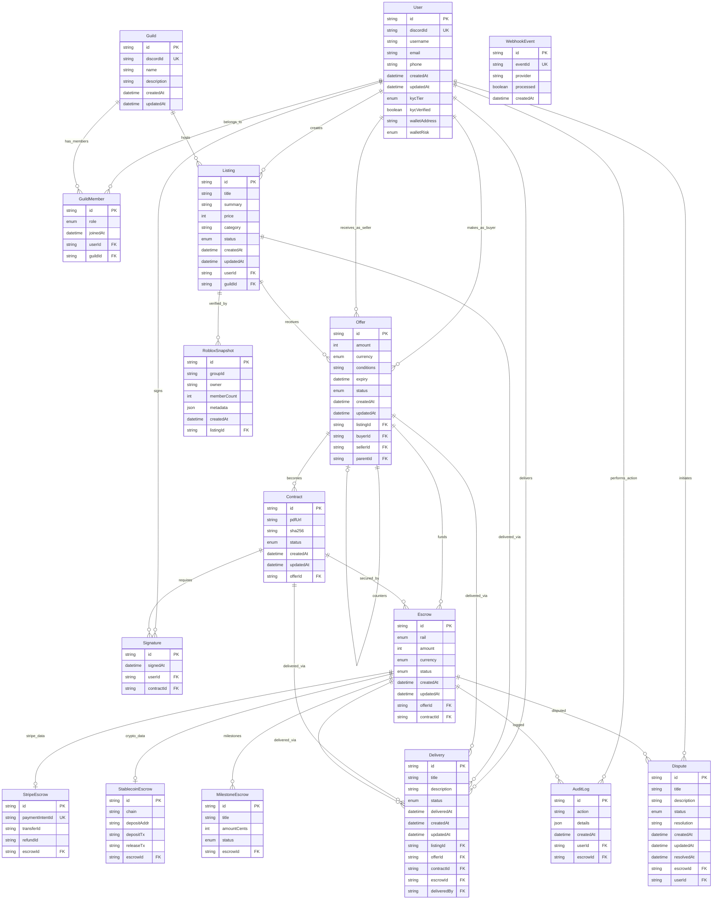
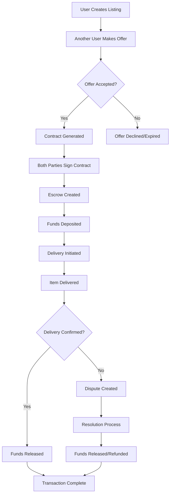
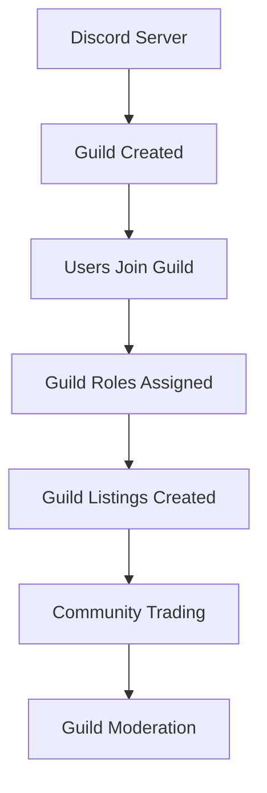
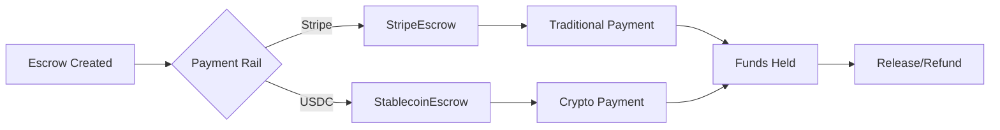
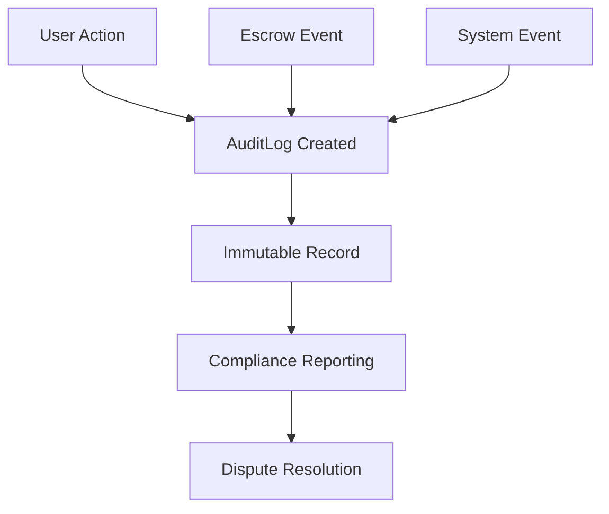

# Database Schema

## Entity Relationship Diagram

## Core Transaction Flow

## Guild Integration Flow

## Payment Rails

## Data Integrity & Audit

## Key Features Highlighted

### 🔐 Security & Compliance

- KYC tiers and verification
- Wallet risk assessment
- Comprehensive audit logging
- Immutable transaction records

### 💰 Multi-Rail Payments

- Stripe for traditional payments
- USDC on Base blockchain
- Milestone-based releases
- Automatic refund capabilities

### 🏛️ Guild System

- Discord server integration
- Role-based permissions
- Community trading
- Guild-specific listings

### 📦 Delivery Tracking

- Status-based workflow
- Confirmation system
- Dispute integration
- Audit trail

### ⚖️ Dispute Resolution

- Escrow-linked disputes
- Status tracking
- Resolution documentation
- Timeline management

This visual schema shows the complete database structure with all relationships, transaction flows, and key features of the Bloxtr8 platform.
