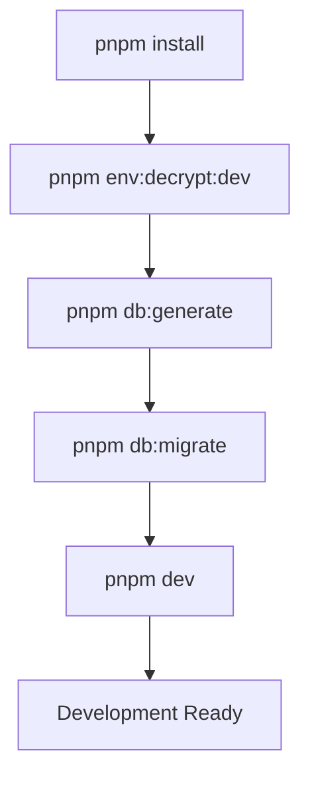
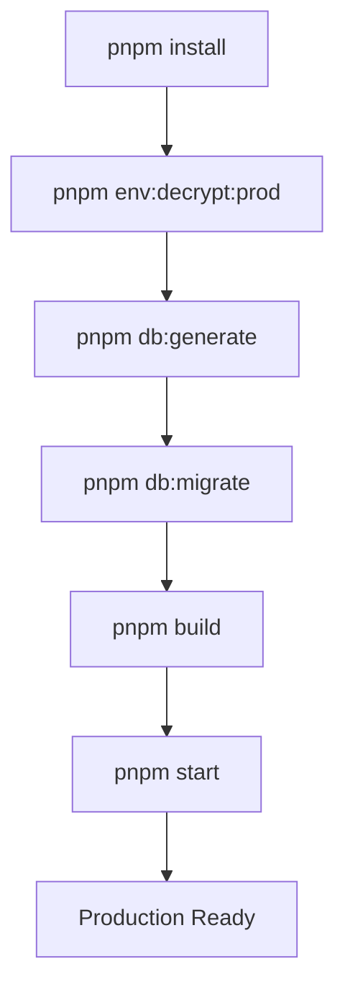
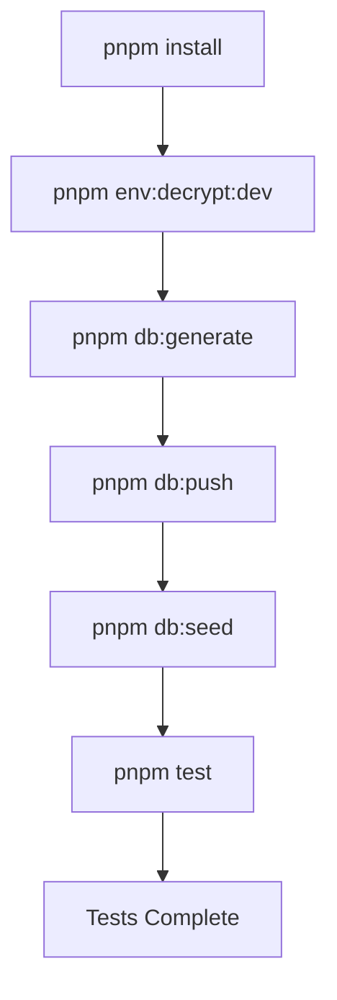

# pnpm Scripts Documentation

This document provides comprehensive documentation for all pnpm scripts available in the Bloxtr8 monorepo.

## Table of Contents

- [Development Scripts](#development-scripts)
- [Build Scripts](#build-scripts)
- [Testing Scripts](#testing-scripts)
- [Database Scripts](#database-scripts)
- [Environment Management](#environment-management)
- [Docker Scripts](#docker-scripts)
- [Code Quality Scripts](#code-quality-scripts)
- [Package-Specific Scripts](#package-specific-scripts)

## Development Scripts

### Core Development

```bash
# Start API server in development mode with hot reload
pnpm dev
# Equivalent to: ./scripts/env-dev.sh dotenvx run -- turbo run dev
```

**What it does:**

- Sets up development environment variables
- Starts all applications in development mode with hot reload
- Uses dotenvx for encrypted environment variable management
- Runs across all workspace packages using Turborepo

**Prerequisites:**

- `.env.development.local` file exists
- `.env.keys` file with development keys
- All dependencies installed

---

## Build Scripts

### Production Build

```bash
# Build all packages for production
pnpm build
# Equivalent to: ./scripts/env-prod.sh dotenvx run -- turbo run build
```

**What it does:**

- Sets up production environment variables
- Builds all TypeScript packages to JavaScript
- Optimizes for production deployment
- Generates declaration files for packages

### Development Build

```bash
# Build all packages with development environment
pnpm build:dev
# Equivalent to: ./scripts/env-dev.sh dotenvx run -- turbo run build
```

**What it does:**

- Same as production build but with development environment
- Useful for testing built packages locally

---

## Testing Scripts

```bash
# Run all tests across the monorepo
pnpm test
# Equivalent to: ./scripts/env-dev.sh dotenvx run -- turbo run test
```

**What it does:**

- Sets up development environment for testing
- Runs Jest tests in all packages
- Uses Turborepo for parallel test execution
- Includes unit, integration, and end-to-end tests

**Test Structure:**

- API tests: `apps/api/src/__tests__/`
- Database tests: Prisma schema validation
- Discord bot tests: Command and interaction testing
- Package tests: Individual package test suites

---

## Database Scripts

### Core Database Operations

```bash
# Generate Prisma client
pnpm db:generate
# Equivalent to: dotenvx run -- pnpm --filter=@bloxtr8/database generate

# Push schema changes to database (development)
pnpm db:push
# Equivalent to: dotenvx run -- pnpm --filter=@bloxtr8/database push

# Run database migrations
pnpm db:migrate
# Equivalent to: dotenvx run -- pnpm --filter=@bloxtr8/database migrate

# Reset database (development only)
pnpm db:reset
# Equivalent to: dotenvx run -- pnpm --filter=@bloxtr8/database reset

# Open Prisma Studio
pnpm db:studio
# Equivalent to: dotenvx run -- pnpm --filter=@bloxtr8/database studio

# Seed database with test data
pnpm db:seed
# Equivalent to: dotenvx run -- pnpm --filter=@bloxtr8/database seed
```

**Database Workflow:**

1. **Development**: Use `db:push` for quick schema iterations
2. **Production**: Use `db:migrate` for versioned schema changes
3. **Reset**: Use `db:reset` to start fresh (development only)
4. **Studio**: Use `db:studio` for visual database management

---

## Environment Management

Environment management uses **dotenvx** for encrypted environment variables that are safely committed to git.

### Encryption/Decryption

```bash
# Encrypt environment files
pnpm env:encrypt           # Encrypt current environment
pnpm env:encrypt:dev       # Encrypt development environment
pnpm env:encrypt:prod      # Encrypt production environment
pnpm env:encrypt:all       # Encrypt both dev and prod environments

# Decrypt environment files
pnpm env:decrypt           # Decrypt current environment
pnpm env:decrypt:dev       # Decrypt development environment
pnpm env:decrypt:prod      # Decrypt production environment
pnpm env:decrypt:all       # Decrypt both dev and prod environments
```

### Environment Utilities

```bash
# Refresh development environment
pnpm env:refresh:dev
# What it does: Encrypts current dev env, cleans old files, decrypts fresh copy

# Set environment variable
pnpm env:set KEY=value

# Get environment variable
pnpm env:get KEY

# List all environment files
pnpm env:ls

# Rotate encryption keys
pnpm env:rotate

# Generate new keypair
pnpm env:keypair
```

### Environment Workflow

1. **Setup**: Create `.env.development.local` and `.env.production.local`
2. **Encrypt**: Run `pnpm env:encrypt:dev` to create `.env.development`
3. **Commit**: Encrypted files can be safely committed
4. **Deploy**: Use private keys to decrypt in production
5. **Rotate**: Periodically rotate keys for security

---

## Docker Scripts

### Development Docker

```bash
# Build Docker images with optimizations
pnpm docker:build
# Equivalent to: ./scripts/docker-optimize.sh build-fast

# Start development environment
pnpm docker:dev
# Equivalent to: ./scripts/docker-optimize.sh dev

# Start development with auto-build
pnpm docker:dev:build
# Equivalent to: ./scripts/docker-optimize.sh dev-build

# Start only database services
pnpm docker:db
# Equivalent to: ./scripts/docker-optimize.sh db-only
```

### Production Docker

```bash
# Start production environment
pnpm docker:prod
# Equivalent to: ./scripts/docker-optimize.sh prod
```

### Docker Management

```bash
# Basic Docker Compose commands
pnpm docker:up         # docker compose up -d
pnpm docker:down       # docker compose down

# Monitoring and debugging
pnpm docker:logs       # Show logs for all services
pnpm docker:stats      # Show resource usage statistics

# Cleanup commands
pnpm docker:clean      # Clean up Docker resources
pnpm docker:prune      # Remove unused Docker resources
pnpm docker:rebuild    # Force rebuild all images

# Testing
pnpm docker:test       # Run tests in Docker environment
```

### Docker Services

The Docker setup includes:

- **API**: Express.js API server
- **Discord Bot**: Discord.js bot application
- **PostgreSQL**: Database with persistent storage
- **MinIO**: S3-compatible object storage
- **Test DB**: Separate database for testing

---

## Code Quality Scripts

### Linting

```bash
# Run ESLint across all packages
pnpm lint

# Auto-fix ESLint issues
pnpm lint:fix
```

**ESLint Configuration:**

- Centralized config in `@bloxtr8/eslint-config`
- TypeScript-specific rules
- Import organization
- Consistent code style

### Formatting

```bash
# Format all files with Prettier
pnpm format

# Check if files are properly formatted
pnpm format:check
```

**Prettier Configuration:**

- Single quotes
- Semicolons
- 2-space indentation
- 80 character line width
- Trailing commas (ES5 style)

---

## Package-Specific Scripts

Each package has its own set of scripts accessible via filters:

### API Package

```bash
# Run API in development
pnpm --filter=@bloxtr8/api dev

# Build API
pnpm --filter=@bloxtr8/api build

# Test API
pnpm --filter=@bloxtr8/api test

# Start built API
pnpm --filter=@bloxtr8/api start
```

### Discord Bot Package

```bash
# Run Discord bot in development
pnpm --filter=@bloxtr8/discord-bot dev

# Build Discord bot
pnpm --filter=@bloxtr8/discord-bot build

# Test Discord bot
pnpm --filter=@bloxtr8/discord-bot test
```

### Database Package

```bash
# Generate Prisma client
pnpm --filter=@bloxtr8/database generate

# Create migration
pnpm --filter=@bloxtr8/database migrate:dev

# Deploy migrations
pnpm --filter=@bloxtr8/database migrate:deploy

# Seed database
pnpm --filter=@bloxtr8/database seed
```

### Shared Packages

```bash
# Build shared utilities
pnpm --filter=@bloxtr8/shared build

# Build types package
pnpm --filter=@bloxtr8/types build

# Build storage utilities
pnpm --filter=@bloxtr8/storage build
```

---

## Script Execution Flow

### Development Workflow



### Production Deployment



### Testing Workflow



---

## Environment Variables

### Required Variables

**Development:**

- `DATABASE_URL` - PostgreSQL connection string
- `DISCORD_BOT_TOKEN` - Discord bot token
- `DISCORD_CLIENT_ID` - Discord application ID
- `STRIPE_SECRET_KEY` - Stripe secret key
- `JWT_SECRET` - JWT signing secret

**Production (additional):**

- `CUSTODIAN_API_KEY` - Custodian service API key
- `AWS_ACCESS_KEY_ID` - AWS access key
- `AWS_SECRET_ACCESS_KEY` - AWS secret key
- `TRM_API_KEY` - TRM Labs API key
- `CHAINALYSIS_API_KEY` - Chainalysis API key

### Environment Files

- `.env.development` - Encrypted development environment (committed)
- `.env.production` - Encrypted production environment (committed)
- `.env.development.local` - Local development environment (not committed)
- `.env.production.local` - Local production environment (not committed)
- `.env.keys` - Encryption keys (not committed)

---

## Troubleshooting

### Common Issues

**Environment not decrypting:**

```bash
# Check if .env.keys exists
ls -la .env.keys

# Recreate keys if missing
pnpm env:keypair

# Try decrypting manually
pnpm env:decrypt:dev
```

**Database connection issues:**

```bash
# Check database status
pnpm db:studio

# Reset database
pnpm db:reset

# Regenerate client
pnpm db:generate
```

**Build failures:**

```bash
# Clean and rebuild
pnpm docker:clean
pnpm docker:rebuild

# Check TypeScript errors
pnpm lint
```

**Docker issues:**

```bash
# Check container status
pnpm docker:stats

# View logs
pnpm docker:logs

# Clean up resources
pnpm docker:prune
```

---

## Best Practices

### Development

1. **Always decrypt environment** before development: `pnpm env:decrypt:dev`
2. **Generate Prisma client** after schema changes: `pnpm db:generate`
3. **Run linting** before committing: `pnpm lint:fix`
4. **Test locally** before pushing: `pnpm test`

### Production

1. **Use production environment**: `pnpm env:decrypt:prod`
2. **Run migrations** before deployment: `pnpm db:migrate`
3. **Build before deploying**: `pnpm build`
4. **Monitor with Docker stats**: `pnpm docker:stats`

### Security

1. **Never commit `.env.keys`** file
2. **Rotate keys regularly**: `pnpm env:rotate`
3. **Use encrypted environments**: Always encrypt before commit
4. **Limit access** to production keys

---

## Performance Tips

### Development

- Use `pnpm docker:db` to run only database services
- Use `pnpm --filter` to work with specific packages
- Use `pnpm docker:dev` for full environment with hot reload

### Production

- Use `pnpm docker:prod` for production deployment
- Use `pnpm docker:clean` to free up disk space
- Monitor with `pnpm docker:stats`

### Troubleshooting Performance

- Use `pnpm docker:prune` to clean unused resources
- Use `pnpm docker:rebuild` for fresh builds
- Check logs with `pnpm docker:logs`

This documentation covers all available scripts and their usage patterns. For specific package documentation, refer to the individual README files in each application and package directory.
